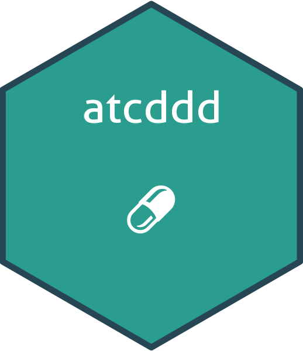

# Logo Creation Guide for atcddd Package

This script generates 5 different professional logo options for the `atcddd` R package, all with **transparent backgrounds**.

## Quick Start

```r
# Run the logo creation script
source("create_logo.R")
```

This will generate 5 PNG files with transparent backgrounds in `man/figures/`:

## ✨ Key Features

- **Transparent Backgrounds** - Works on white, dark, or colored backgrounds
- **High Resolution** - 300 DPI for crisp, professional appearance
- **Consistent Design** - Professional color palette across all options
- **Hex Sticker Format** - Standard hexagon shape for R package branding

## Logo Options

### Option 1: Hierarchy Bar Chart
**File:** `logo_option1.png`  
**Theme:** Data visualization showing the 5-level ATC hierarchy  
**Best for:** Emphasizing the hierarchical structure and data analysis capabilities  
**Colors:** Blue-green gradient with warm accents

### Option 2: Molecular Network
**File:** `logo_option2.png`  
**Theme:** Connected nodes representing drug relationships  
**Best for:** Scientific/research focus, showing interconnectedness  
**Colors:** Teal connections with dark nodes

### Option 3: Medical Cross + Data
**File:** `logo_option3.png`  
**Theme:** Healthcare symbol combined with data points  
**Best for:** Clear medical/pharmaceutical identity  
**Colors:** Teal cross with orange data points

### Option 4: Pills/Capsules ⭐ RECOMMENDED
**File:** `logo_option4.png`  
**Theme:** Stylized pharmaceutical capsules in 5 colors  
**Best for:** Immediate recognition as a pharmacy/drug classification tool  
**Colors:** Full spectrum from blues to oranges (representing ATC levels)  
**Why recommended:** Clear, recognizable, and directly relates to medications

### Option 5: Minimalist ATC Text
**File:** `logo_option5.png`  
**Theme:** Clean typography with "ATC" letters and bar chart  
**Best for:** Modern, minimalist aesthetic  
**Colors:** Dark blue text with teal/blue bars

## Color Palette

All logos use a consistent, professional color scheme:

- **#264653** - Deep blue-green (primary text/elements)
- **#2a9d8f** - Teal (hex border, accents)
- **#e9c46a** - Golden yellow
- **#f4a261** - Coral orange
- **#e76f51** - Warm red

## Choosing Your Logo

1. Review all 5 options in `man/figures/`
2. Pick the one that best represents your package vision
3. Rename it to `logo.png`:

```r
# Example: Select option 4 (pills theme)
file.copy("man/figures/logo_option4.png", 
          "man/figures/logo.png", 
          overwrite = TRUE)
```

4. Update your `README.md`:

```markdown

```

## Customization

To customize any logo, edit `create_logo.R`:

- **Package name:** Change `package = "atcddd"` parameter
- **Colors:** Modify hex color codes
- **Size:** Adjust `p_size` (package name size)
- **Position:** Change `p_y`, `s_x`, `s_y` coordinates
- **Border:** Modify `h_color` and `h_size`
- **Background:** Set `h_fill` (currently "transparent")

## Requirements

```r
install.packages(c("hexSticker", "ggplot2", "dplyr", "showtext"))
```

## Specifications

- **Format:** PNG with alpha channel (transparency)
- **Resolution:** 300 DPI (high quality for print and web)
- **Dimensions:** Standard hexagon sticker size
- **Background:** Transparent (works on any color)
- **Border:** Teal color (#2a9d8f) with professional thickness

## Tips

- **For GitHub:** Option 4 (pills) or Option 1 (hierarchy) work best
- **For CRAN:** Option 5 (minimalist) or Option 1 (hierarchy) are more conservative
- **For presentations:** Option 2 (network) or Option 4 (pills) are visually striking
- **For academic papers:** Option 1 (hierarchy) or Option 5 (minimalist) are more formal
- **Dark themes:** All options work perfectly thanks to transparent backgrounds!

## Preview Before Deciding

Open all files in `man/figures/` and compare side-by-side before choosing!

**Pro tip:** Preview logos on both white and dark backgrounds to see how the transparency looks.
