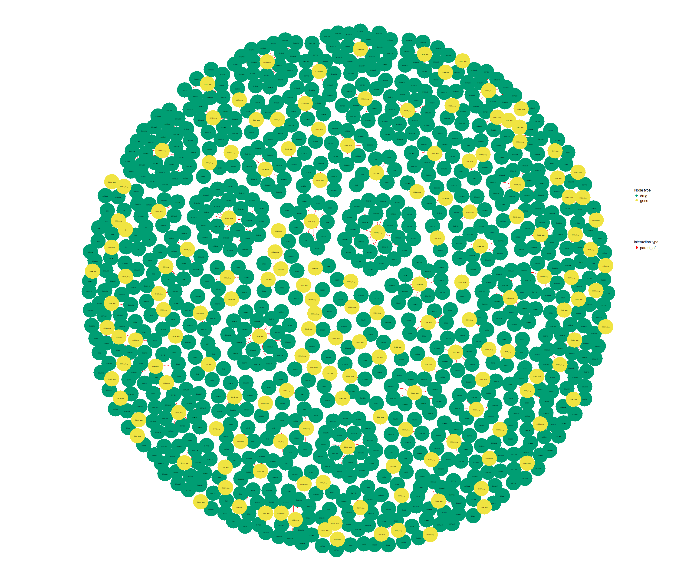
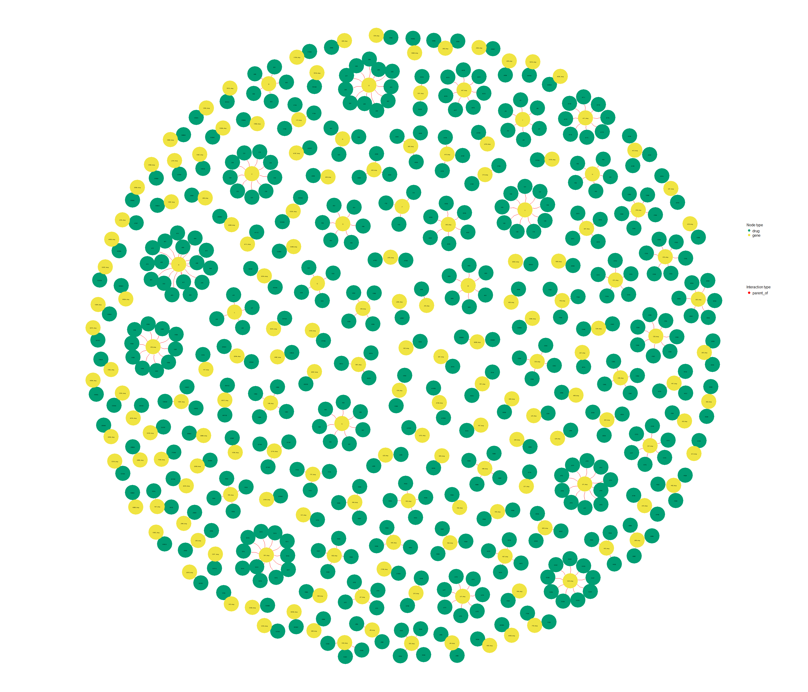
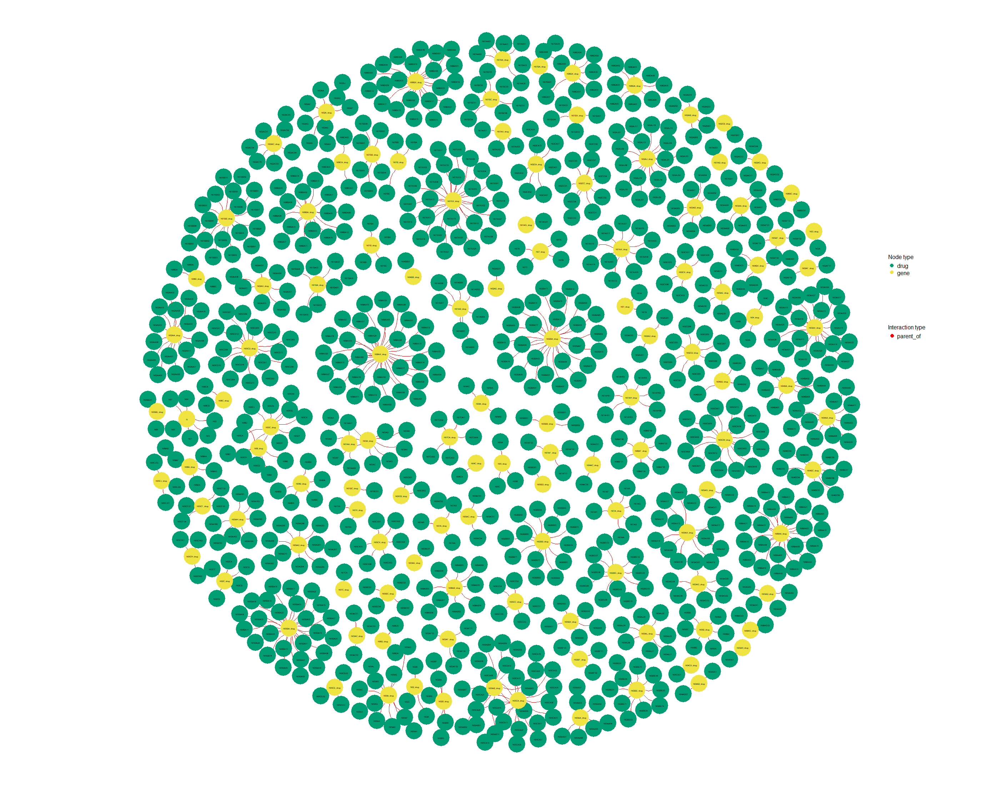
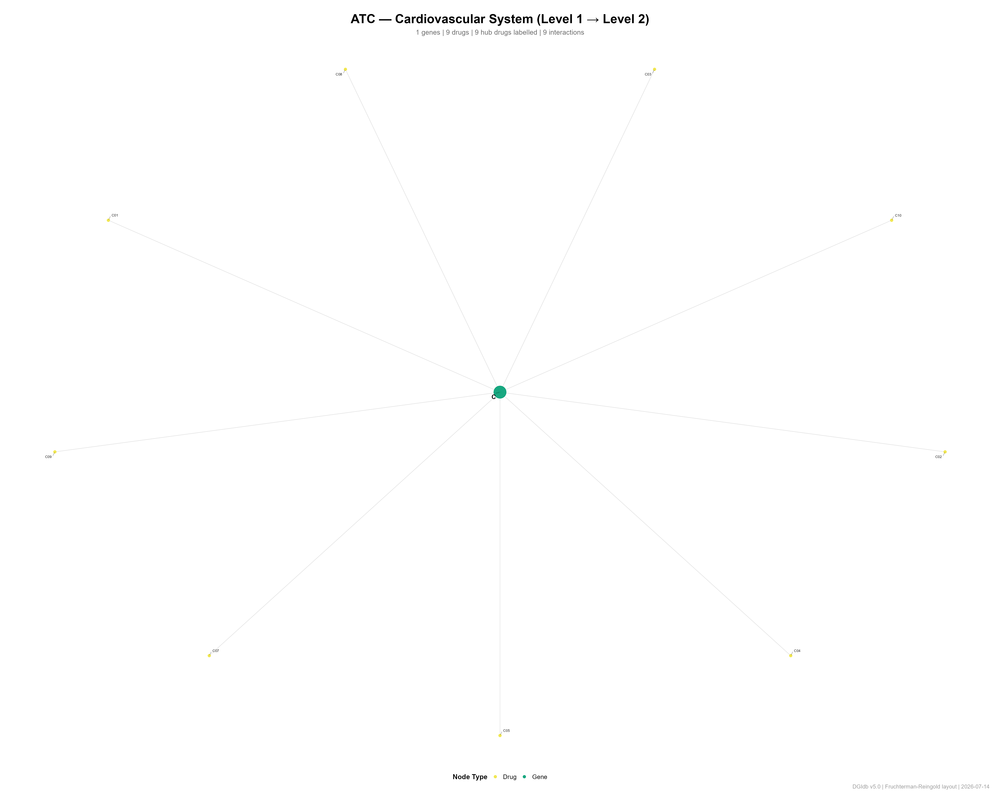

<div align="center">
  
  <h1>atcddd</h1>
  <h3><em>Work with ATC Drug Classification Codes in R</em></h3>
  <br>
  
  [](https://lifecycle.r-lib.org/articles/stages.html)
  [](https://github.com/vanhungtran/atcddd/actions)
  [](https://opensource.org/licenses/MIT)
  [](https://doi.org/10.5281/zenodo.21360365)
</div>

<br>

> 🧬 A complete R toolkit for the WHO Anatomical Therapeutic Chemical (ATC) classification system and Defined Daily Doses (DDD).  
> **Offline drug name resolution · Brand synonyms · Fuzzy matching · DDD computation · Hierarchy navigation · Clinical text extraction**

---

## ✨ What is atcddd?

Imagine you're a pharmacoepidemiologist with a list of drug names — aspirin, lipitor, metformin — and you need their ATC codes and Defined Daily Doses. You could browse the WHO website one drug at a time... or you could type:

```r
library(atcddd)
resolve_atc("aspirin", source = "local")
```

And get back: `N02BA01 · acetylsalicylic acid · DDD: 3 g (Oral)` — instantly, offline.

**atcddd** bundles the complete WHO ATC/DDD index (6,982 codes, 6,218 DDD entries) so you can search, resolve, compute, and explore without ever needing an internet connection. It also knows brand names (lipitor → atorvastatin), handles typos (acetominophen → paracetamol), and can compute DDDs from raw prescription data.

---

## 🚀 Install

```r
remotes::install_github("vanhungtran/atcddd")
library(atcddd)
```

---

## 🧪 In 30 Seconds

<table>
<tr>
<td width="50%" valign="top">

**🔍 Instant drug lookup**
```r
resolve_atc("aspirin")
resolve_atc("lipitor")
resolve_batch(
  c("aspirin", "tylenol", "advil")
)
```

</td>
<td width="50%" valign="top">

**💊 Compute DDDs from prescriptions**
```r
compute_ddd(data.frame(
  atc_code = c("N02BA01", "C10AA05"),
  quantity = c(100, 30),
  strength = c(500, 20)
))
```

</td>
</tr>
<tr>
<td width="50%" valign="top">

**🌳 Explore the hierarchy**
```r
atc_children("C10AA", codes)
atc_descendants("N", codes)
atc_level("N02BE01")      # → 5
atc_parent("N02BE01")     # → N02BE
```

</td>
<td width="50%" valign="top">

**📝 Extract from clinical notes**
```r
atc_from_text(
  "Patient on metformin 500mg and lipitor 20mg"
)
```

</td>
</tr>
</table>

---

## 📊 What's in the Data?

The WHO ATC classification organises every drug into a 5-level tree, from broad anatomical groups down to individual substances:

| Level | Pattern | Example | Meaning |
|-------|---------|---------|---------|
| 1 · Anatomical | `N` | N | Nervous system |
| 2 · Therapeutic | `N02` | N02 | Analgesics |
| 3 · Pharmacological | `N02B` | N02B | Other analgesics & antipyretics |
| 4 · Chemical | `N02BE` | N02BE | Anilides |
| 5 · Substance | `N02BE01` | N02BE01 | Paracetamol |

**6,982 codes · 6,218 DDD entries** — bundled with the package, crawled fresh from WHO in July 2026.

---

## 🎨 Visualising the WHO ATC/DDD Index

### How many drugs have a Defined Daily Dose?

Not all drugs have DDDs — topicals, ophthalmics, and fixed-dose combinations typically don't. Systemic drugs like anti-infectives and nervous system agents do. The chart below tells the story:


### How the ATC tree fans out

From 14 anatomical groups to over 6,000 individual substances — the ATC tree fans out like a pyramid, each level branching into more specific categories:


### The same drug, different routes

DDDs can be dramatically different depending on whether a drug is given orally, by injection, or rectally. These small multiples show 8 drugs with 3+ route-specific DDDs:


### DDD coverage × route, across all drug classes

This heatmap shows a clear pattern: oral and parenteral routes are well-covered across most systemic groups, while topical routes have sparse coverage across the board:


### The ATC hierarchy as a network

Every ATC code is a node in a beautiful bipartite tree. These network visualisations — built with the **Repurp** package — show how the hierarchy branches:

<br>

| Cardiovascular System | All ATC Groups (L1–L4) |
|:---:|:---:|
|  |  |
| 830 connections, igraph + Fruchterman-Reingold | 445 connections across all 14 anatomical groups |

| Nervous System | CV Top Level (ggraph) |
|:---:|:---:|
|  |  |
| 787 connections in the nervous system branch | L1→L2 with publication-quality ggrepel labels |

These networks show how 14 anatomical roots branch into therapeutic subgroups, chemical classes, and thousands of individual drugs — all from a single table of parent–child relationships.

---

## 🔍 What Can You Do?

<details>
<summary><b>🔍 Drug Name Search & Resolution</b> — <i>Your everyday workflow</i></summary>
<br>

| Function | What it does |
|----------|-------------|
| `resolve_atc("aspirin")` | Drug name → ATC code + DDD. Works offline. |
| `resolve_batch(c("a", "b"))` | Vectorised resolution for many drugs at once |
| `search_drug("statin")` | Ranked search: synonym → exact → prefix → substring |
| `fuzzy_match_drug("asprin")` | Levenshtein distance for typos |
| `atc_from_text("...")` | Extract drug names from clinical notes |
| `atc_add_synonym("eliquis", "B01AF02")` | Add your own brand name mappings |

```r
# Your daily workflow — offline, instant
resolve_batch(c("aspirin", "lipitor", "metformin"), source = "local")
```

</details>

<details>
<summary><b>💊 DDD Computation</b> — <i>From prescriptions to Defined Daily Doses</i></summary>
<br>

| Function | What it does |
|----------|-------------|
| `compute_ddd()` | Convert prescription data into DDDs per drug |
| `compute_did()` | DDDs per 1000 inhabitants per day (DID) |
| `ddd_availability()` | Which groups have DDDs assigned |
| `ddd_route_comparison("N02BE01")` | Compare DDDs across administration routes |

```r
prescriptions <- data.frame(
  atc_code = c("N02BA01", "C10AA05", "A10BA02"),
  quantity = c(100, 30, 90),
  strength = c(500, 20, 500)
)

ddd <- compute_ddd(prescriptions)
compute_did(ddd, population = 10000, days = 30)
```

**Unit conversion is automatic** — mg ↔ g ↔ mcg, U ↔ TU ↔ MU. No manual maths.

</details>

<details>
<summary><b>🌳 Offline Hierarchy Navigation</b> — <i>No internet needed</i></summary>
<br>

| Function | What it does |
|----------|-------------|
| `atc_children("C10AA", data)` | Direct children of any ATC code |
| `atc_descendants("C", data)` | Everything below, down to Level 5 |
| `atc_level("N02BE01")` | Returns the hierarchy level (1–5) |
| `atc_parent("N02BE01")` | The immediate parent code |

```r
atc_children("C10AA", codes)        # All statins
atc_descendants("N", codes)         # All nervous system substances
atc_parent("N02BE01")               # → N02BE
atc_level(c("N", "N02", "N02BE01")) # → 1, 2, 5
```

</details>

<details>
<summary><b>✅ Validation & Utilities</b></summary>
<br>

```r
is_valid_atc_code(c("N02BE01", "C10AA05", "garbage"))
# [1]  TRUE  TRUE FALSE
normalize_atc_code(" n02be01 ")  # → "N02BE01"
```

</details>

<details>
<summary><b>🌐 WHO Data Crawling</b> — <i>Live retrieval with caching</i></summary>
<br>

```r
res <- atc_crawl(roots = "D", rate = 0.5, max_codes = 100)
get_atc_data("N02")
get_atc_hierarchy("N02")
atc_roots_default()
```

</details>

<details>
<summary><b>📁 Data I/O & Reproducibility</b></summary>
<br>

```r
atc_write_csv(res, dir = "data")         # Export to CSV
atc_write_manifest(paths)                # SHA256 checksums
atc_load_db()                            # Load bundled data into memory
```

</details>

---

## 🎯 Why atcddd?

| Feature | **atcddd** | AMR (CRAN) |
|---------|:----------:|:----------:|
| **All ATC groups** (not just antimicrobials) | ✅ | ❌ |
| **Offline drug name lookup** | ✅ | ❌ |
| **Fuzzy matching** (typos) | ✅ | ❌ |
| **Brand name synonyms** | ✅ | ❌ |
| **Free-text extraction** | ✅ | ⚠️ limited |
| **DDD computation** with unit conversion | ✅ | ❌ |
| **Hierarchy tools** | ✅ | ❌ |
| **Bundled data** | 6,982 codes | ~620 drugs |

---

## 📖 Vignettes

| Vignette | What you'll learn |
|----------|-------------------|
| [Getting Started](https://vanhungtran.github.io/atcddd/articles/vignettes.html) | Install, first steps, crawl, validate |
| [Navigating the ATC Hierarchy](https://vanhungtran.github.io/atcddd/articles/atc-hierarchy.html) | Parents, children, descendants, ancestry |
| [Working with DDDs](https://vanhungtran.github.io/atcddd/articles/ddd-analysis.html) | Understanding DDD coverage and data quality |
| [Computing DDDs](https://vanhungtran.github.io/atcddd/articles/computing-ddd.html) | Prescription data → DDDs, step by step |

---

## 📖 Citation

If you use `atcddd` in your work, please cite:

> Van Hung (Huynh) TRAN. (2026). vanhungtran/atcddd: v0.2.0 (Version v0.2.0) [Computer software]. Zenodo. https://doi.org/10.5281/zenodo.21360365

```bibtex
@software{tran2026atcddd,
  author    = {Van Hung (Huynh) TRAN},
  title     = {vanhungtran/atcddd: v0.2.0},
  year      = {2026},
  publisher = {Zenodo},
  version   = {v0.2.0},
  doi       = {10.5281/zenodo.21360365}
}
```

---

## 🤝 Contributing

Bug reports, feature requests, and pull requests are welcome.  
See [CONTRIBUTING.md](CONTRIBUTING.md) and the [Code of Conduct](CODE_OF_CONDUCT.md).

---

## 📜 License

**MIT** © 2025 Lucas VHH TRAN. See [LICENSE.md](LICENSE.md).

**Data**: WHO ATC/DDD Index © WHO Collaborating Centre for Drug Statistics Methodology. Freely available for non-commercial research. https://atcddd.fhi.no/

---

<div align="center">
<br>
<em>Built with 💊 and 🧬 for the R health data science community.</em>
<br><br>
</div>
