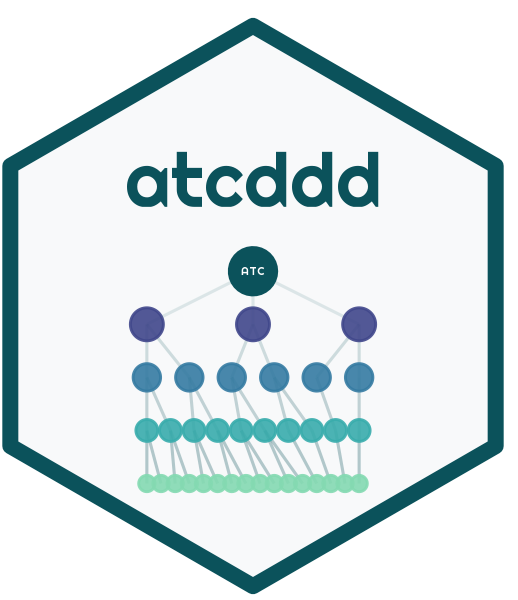

<div align="center">
  
  <h1>atcddd</h1>
  <h3><em>Work with ATC Drug Classification Codes in R</em></h3>

  [](https://lifecycle.r-lib.org/articles/stages.html)
  [](https://github.com/vanhungtran/atcddd/actions)
  [](https://opensource.org/licenses/MIT)
  [](https://github.com/vanhungtran/atcddd)
  [](https://doi.org/10.5281/zenodo.21360365)

</div>

<br>

> 🧬 **Classify. Validate. Search. Compute.**  
> A complete R toolkit for the WHO Anatomical Therapeutic Chemical (ATC) classification system and Defined Daily Doses (DDD) — with **offline drug name resolution**, **fuzzy matching**, **DDD computation**, and **hierarchy navigation**.

---

<br>

<table>
<tr>
<td width="50%" valign="top">

### ✨ One-liner
```r
resolve_atc("aspirin", source = "local")
#>         ┌────────────  N02BA01 ────────────┐
#>         │  acetylsalicylic acid  ·  3 g Oral│
#>         └───────────────────────────────────┘
```

</td>
<td width="50%" valign="top">

### 📦 Install
```r
remotes::install_github("vanhungtran/atcddd")
library(atcddd)
```

</td>
</tr>
</table>

<br>

---

## 🧪 Quick Start — 30-Second Workflow

<table>
<tr>
<td>

### 🔍 Find any drug
```r
resolve_atc("lipitor")
# ── lipitor → C10AA05 (atorvastatin) ──
#    DDD: 20 mg (Oral)
```

**Brands, generics, typos — all work.**
```r
resolve_batch(c("aspirin", "tylenol", "advil"))
```

</td>
<td>

### 💊 Compute DDDs
```r
compute_ddd(data.frame(
  atc_code = c("N02BA01", "C10AA05"),
  quantity = c(100, 30),
  strength = c(500, 20)
))
#   ddd_value ddd_ratio
# 1        3      16.7
# 2       20      30.0
```

</td>
</tr>
<tr>
<td>

### 🌳 Navigate the tree
```r
codes <- read.csv(system.file("extdata",
  "WHO_ATC_codes_2026-07-14.csv",
  package = "atcddd"))

atc_children("C10AA", codes)
# 1 C10AA01  simvastatin
# 2 C10AA02  lovastatin
# 3 C10AA05  atorvastatin
# ...
```

</td>
<td>

### 📝 From clinical notes
```r
atc_from_text(
  "Patient on metformin 500mg BID and lipitor 20mg"
)
# 1 A10BA02  metformin
# 2 C10AA05  atorvastatin
```

</td>
</tr>
</table>

---

## 📊 Visualising WHO ATC/DDD Data

### 🎯 DDD Coverage by Anatomical Group

<details open>
<summary><i>Systemic drugs have DDDs; topicals, ophthalmics, and combinations typically don't</i></summary>
<br>


</details>

<br>

### 🌲 ATC Hierarchy: From 14 Groups to 7,000+ Substances

<details open>
<summary><i>The tree fans out from 14 anatomical main groups to thousands of individual drugs</i></summary>
<br>


</details>

<br>

### 🚑 DDDs Differ by Administration Route

<details open>
<summary><i>Same drug, different routes — dramatically different DDDs</i></summary>
<br>


</details>

<br>

### 🗺️ DDD Coverage: Groups × Routes

<details open>
<summary><i>Which classes have DDDs — and by which route?</i></summary>
<br>


</details>

---

## 🧬 What is the ATC Classification System?

The <b>A</b>natomical <b>T</b>herapeutic <b>C</b>hemical system classifies every drug into a 5‑level hierarchy:

| Level | Pattern | Example | Meaning |
|-------|---------|---------|---------|
| 1 · Anatomical | `A` | **N** | Nervous system |
| 2 · Therapeutic | `A00` | **N02** | Analgesics |
| 3 · Pharmacological | `A00A` | **N02B** | Other analgesics & antipyretics |
| 4 · Chemical | `A00AA` | **N02BE** | Anilides |
| 5 · Substance | `A00AA00` | **N02BE01** | Paracetamol |

> **📦 6,982 codes · 6,218 DDD entries** — bundled with the package, updated July 2026.

---

## 🔬 Feature Deep-Dive

<details>
<summary><b>🔍 Drug Name Search & Resolution</b> — <i>Your #1 workflow, solved</i></summary>
<br>

| Function | What it does |
|----------|-------------|
| `resolve_atc("aspirin")` | Drug name → ATC code + DDD. Works offline. |
| `resolve_batch(c("a", "b"))` | Vectorised resolution for many drugs at once |
| `search_drug("statin")` | Ranked search: synonym → exact → starts_with → contains → word |
| `fuzzy_match_drug("asprin")` | Levenshtein distance matching for typos |
| `atc_from_text("...")` | Extract drug names from free-text clinical notes |
| `atc_add_synonym("eliquis", "B01AF02", "apixaban")` | Register custom brand/name mappings |

```r
# Your daily workflow — offline, instant
resolve_batch(c("aspirin", "lipitor", "metformin"), source = "local")
```

</details>

<details>
<summary><b>💊 DDD Computation</b> — <i>Prescription data → Defined Daily Doses</i></summary>
<br>

| Function | What it does |
|----------|-------------|
| `compute_ddd(prescriptions)` | Convert prescription data into DDDs per drug |
| `compute_did(ddd_data, pop, days)` | DDDs per 1000 inhabitants per day (DID) |
| `ddd_availability()` | Summary of which groups have DDDs assigned |
| `ddd_route_comparison("N02BE01")` | Compare DDDs across administration routes |

```r
prescriptions <- data.frame(
  atc_code = c("N02BA01", "C10AA05", "A10BA02"),
  quantity = c(100, 30, 90),
  strength = c(500, 20, 500)
)

ddd <- compute_ddd(prescriptions)
compute_did(ddd, population = 10000, days = 30)
```

**Unit conversion is automatic** — mg ↔ g ↔ mcg, U ↔ TU ↔ MU. No manual maths.

</details>

<details>
<summary><b>🌳 Offline Hierarchy Navigation</b> — <i>No internet needed</i></summary>
<br>

| Function | What it does |
|----------|-------------|
| `atc_children("C10AA", data)` | Direct children of any ATC code |
| `atc_descendants("C", data)` | Everything below, down to Level 5 |
| `atc_level("N02BE01")` | Returns the hierarchy level (1–5) |
| `atc_parent("N02BE01")` | The immediate parent code |

```r
# Trace the ancestry of any drug
atc_children("N", codes)    # All nervous system subgroups
atc_descendants("C10AA", codes)  # All statins and their drugs
atc_parent("N02BE01")      # → N02BE (anilides)
atc_level(c("N", "N02", "N02BE01"))  # → 1, 2, 5
```

</details>

<details>
<summary><b>✅ ATC Code Validation</b> — <i>Vectorised, fast</i></summary>
<br>

```r
is_valid_atc_code(c("N02BE01", "C10AA05", "garbage"))
# [1]  TRUE  TRUE FALSE
```

| Function | What it does |
|----------|-------------|
| `is_valid_atc_code(x)` | Check one or more ATC codes (vectorised) |
| `normalize_atc_code(x)` | Trim + uppercase (canonical form) |

</details>

<details>
<summary><b>🌐 WHO Data Crawling</b> — <i>Live retrieval with caching</i></summary>
<br>

| Function | What it does |
|----------|-------------|
| `atc_crawl(roots = "D")` | Crawl WHO ATC/DDD index with rate limiting |
| `get_atc_data("N02")` | API-style data retrieval |
| `get_atc_hierarchy("N02")` | Live hierarchy with parent/child metadata |
| `atc_roots_default()` | The 14 main anatomical groups |

```r
# Fetch the latest data for dermatologicals
res <- atc_crawl(roots = "D", rate = 0.5, max_codes = 100)
```

</details>

<details>
<summary><b>📁 Data I/O & Reproducibility</b></summary>
<br>

| Function | What it does |
|----------|-------------|
| `atc_write_csv(res, dir = "data")` | Export results to dated CSV files |
| `atc_manifest(paths)` | Generate SHA256 checksums |
| `atc_write_manifest(paths)` | Save checksum manifest |
| `atc_load_db()` | Load bundled WHO data into memory cache |

</details>

---

## 🎯 Why atcddd?

| Feature | **atcddd** | AMR (CRAN) | Other tools |
|---------|:----------:|:----------:|:-----------:|
| **All ATC groups** (not just antimicrobials) | ✅ | ❌ | — |
| **Offline drug name lookup** (no internet) | ✅ | ❌ | ❌ |
| **Fuzzy matching** (typo-tolerant) | ✅ | ❌ | ❌ |
| **Brand name synonyms** (lipitor → atorvastatin) | ✅ | ❌ | ❌ |
| **Free-text extraction** from clinical notes | ✅ | ⚠️ limited | ❌ |
| **DDD computation** with unit conversion | ✅ | ❌ | ❌ |
| **Hierarchy tools** (children, descendants) | ✅ | ❌ | ❌ |
| **WHO crawling** with rate limiting | ✅ | ✅ | ❌ |
| **Vectorised ATC validation** | ✅ | ❌ | — |
| **Bundled data** (6,982 codes) | ✅ | ⚠️ 620 only | — |

---

## 📖 Vignettes

| Vignette | Description |
|----------|-------------|
| [Getting Started](https://vanhungtran.github.io/atcddd/articles/vignettes.html) | Package overview, installation, first steps |
| [Navigating the ATC Hierarchy](https://vanhungtran.github.io/atcddd/articles/atc-hierarchy.html) | Tree traversal, parents, children, descendants |
| [Working with DDDs](https://vanhungtran.github.io/atcddd/articles/ddd-analysis.html) | Understanding DDD coverage, data quality |
| [Computing DDDs from Prescription Data](https://vanhungtran.github.io/atcddd/articles/computing-ddd.html) | Step-by-step DDD computation workflow |

---

## 🤝 Contributing

Contributions are welcome — open an [issue](https://github.com/vanhungtran/atcddd/issues) or submit a PR.

- [Contributing Guidelines](CONTRIBUTING.md)
- [Code of Conduct](CODE_OF_CONDUCT.md)

---

## 📜 License & Attribution

**MIT** © 2025 Lucas VHH TRAN. See [LICENSE.md](LICENSE.md).

**Data**: WHO ATC/DDD Index © WHO Collaborating Centre for Drug Statistics Methodology (https://atcddd.fhi.no/). The WHO data is freely available for non-commercial research use.

---

## 📖 Citation

If you use `atcddd` in your research, please cite:

> Van Hung (Huynh) TRAN. (2026). vanhungtran/atcddd: v0.2.0 (Version v0.2.0) [Computer software]. Zenodo. https://doi.org/10.5281/zenodo.21360365

```bibtex
@software{tran2026atcddd,
  author    = {Van Hung (Huynh) TRAN},
  title     = {vanhungtran/atcddd: v0.2.0},
  year      = {2026},
  publisher = {Zenodo},
  version   = {v0.2.0},
  doi       = {10.5281/zenodo.21360365},
  url       = {https://doi.org/10.5281/zenodo.21360365}
}
```

---

<div align="center">
<br>
<em>Built with 💊 and 🧬 for the R health data science community.</em>
<br><br>
<sub>
  [📦 GitHub](https://github.com/vanhungtran/atcddd) ·
  [🐛 Issues](https://github.com/vanhungtran/atcddd/issues) ·
  [📖 Docs](https://vanhungtran.github.io/atcddd)
</sub>
</div>
