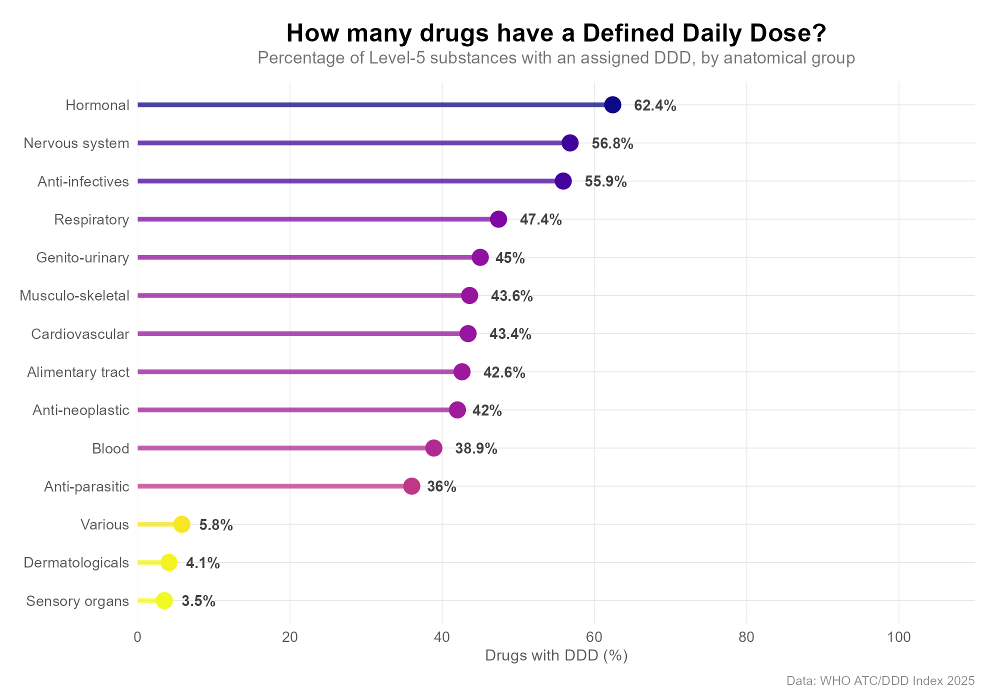
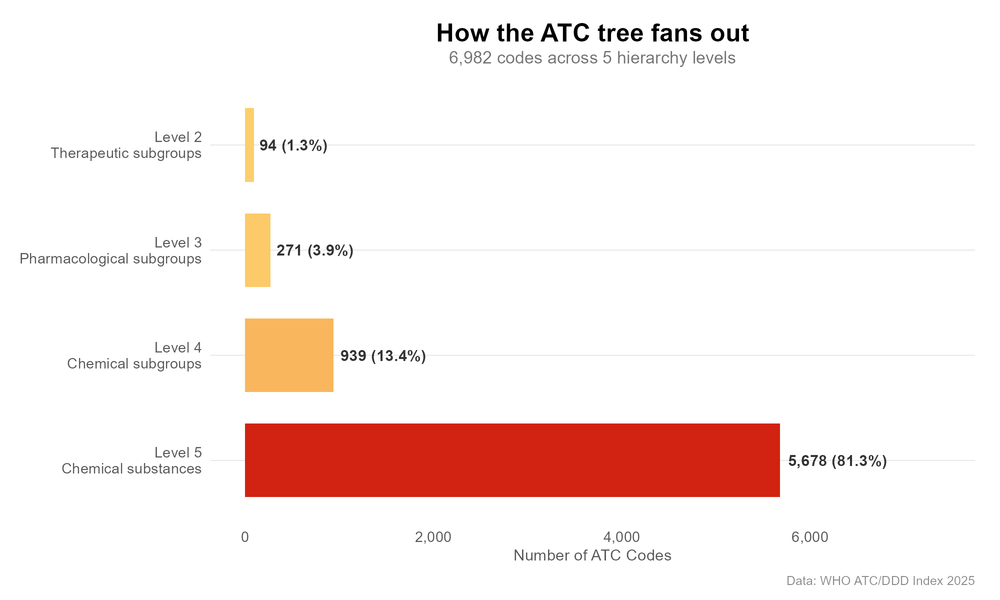
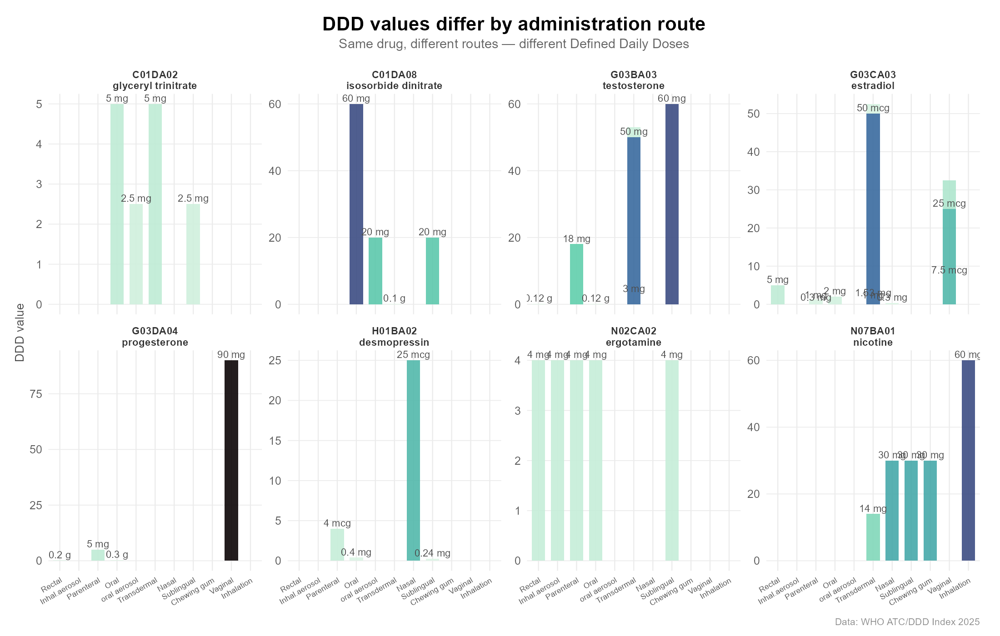
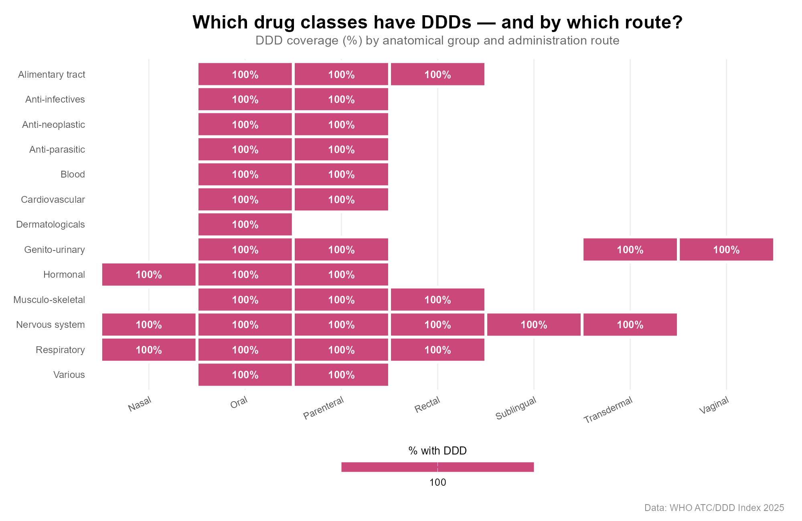

# 🧬 atcddd

### *Work with ATC (Anatomical Therapeutic Chemical) Codes in R*

[](https://lifecycle.r-lib.org/articles/stages.html)
[](https://github.com/vanhungtran/atcddd/actions)
[](https://opensource.org/licenses/MIT)
[](https://github.com/vanhungtran/atcddd)

> *Classify, validate, search, and compute — all in R.*

---

## 📖 Overview

**`atcddd`** is a comprehensive R package for working with the World Health
Organization's **Anatomical Therapeutic Chemical (ATC) Classification System**
and **Defined Daily Dose (DDD)** values. It provides a complete toolkit for
pharmacoepidemiology and drug utilisation research.

### What you can do

| Workflow | How | Offline? |
|----------|-----|:--------:|
| **Validate** ATC codes | `is_valid_atc_code("N02BE01")` | ✅ |
| **Search** drug names | `search_drug("aspirin")` | ✅ |
| **Resolve** brand names | `resolve_atc("lipitor")` → ATC code + DDD | ✅ |
| **Navigate** the hierarchy | `atc_children("C10AA", data)` | ✅ |
| **Compute** DDDs from prescriptions | `compute_ddd(prescriptions)` | ✅ |
| **Extract** drugs from clinical notes | `atc_from_text("patient on metformin")` | ✅ |
| **Crawl** the WHO index | `atc_crawl(roots = "D")` | 🌐 |

### Key Features

- **Offline drug name search** — bundled WHO database for instant lookups
- **Brand name synonyms** — "lipitor", "tylenol", "advil" → correct ATC codes
- **Fuzzy matching** — handles typos like "acetominophen"
- **DDD computation** — prescription data → Defined Daily Doses, with unit conversion
- **Hierarchy navigation** — children, descendants, levels, parents
- **Free-text extraction** — pull drug names from clinical notes
- **WHO crawling** — live retrieval with caching and rate limiting

---

## 🚀 Installation

```r
# From GitHub
install.packages("remotes")
remotes::install_github("vanhungtran/atcddd")
```

```r
library(atcddd)
```

---

## 🧪 Quick Start

### Resolve drug names to ATC codes (your #1 workflow)

```r
# Instant, offline lookup
resolve_atc("aspirin", source = "local")
#> ── aspirin → N02BA01 (acetylsalicylic acid) ──
#>    DDD: 3 g (Oral)

# Brand names work too
resolve_atc("lipitor", source = "local")
#> ── lipitor → C10AA05 (atorvastatin) ──
#>    DDD: 20 mg (Oral)

# Batch resolve a list of medications
medications <- c("aspirin", "metformin", "atorvastatin", "ibuprofen")
resolve_batch(medications, source = "local")
```

### Search by drug name

```r
# Find all drugs containing "statin"
search_drug("statin", max_results = 5)
```

### Fuzzy match misspelled drug names

```r
# Typo-tolerant matching
fuzzy_match_drug("acetominophen")
fuzzy_match_drug("metmorphin")  # → metformin
```

### Extract drugs from clinical text

```r
atc_from_text("Patient was started on atorvastatin 20 mg daily")
```

### Compute DDDs from prescription records

```r
prescriptions <- data.frame(
  patient_id    = c(1, 1, 2),
  atc_code      = c("N02BA01", "C10AA05", "A10BA02"),
  quantity      = c(100, 30, 90),
  strength      = c(500, 20, 500)
)
compute_ddd(prescriptions)
```

### Navigate the ATC hierarchy

```r
# Load bundled data
codes <- read.csv(system.file("extdata", "WHO_ATC_codes_2026-07-14.csv",
                               package = "atcddd"))

# Direct children of a class
atc_children("C10AA", codes)  # all statins

# Everything under a branch
atc_descendants("N", codes, max_level = 3)  # nervous system subgroups
```

### Validate ATC codes

```r
# Vectorized — accepts multiple codes at once
is_valid_atc_code(c("N02BE01", "C10AA05", "garbage"))
#> TRUE  TRUE  FALSE

# Hierarchy tools
atc_level("N02BE01")     # 5
atc_parent("N02BE01")    # "N02BE"
```

---

## 📊 Visualising WHO ATC/DDD Data

### DDD Coverage by Anatomical Group

Not all drugs have DDD values — this is by design. Systemic drugs generally do,
while topicals, ophthalmics, and combinations typically don't. The lollipop chart
below shows the striking contrast: anti-infectives and nervous system drugs have
high coverage, while dermatologicals and sensory organs barely register.



### ATC Hierarchy: From 14 Groups to 6,000+ Substances

The ATC tree fans out from 14 anatomical main groups to over 6,000 individual
chemical substances. The steep pyramid shape reflects how each therapeutic class
branches into many specific drugs.



### DDDs Differ by Administration Route

The same drug can have dramatically different DDDs depending on how it's
administered — oral, parenteral, rectal, or transdermal. These small multiples
show 8 drugs with 3+ route-specific DDDs:



### DDD Coverage: Anatomical Groups × Administration Routes

This heatmap reveals the interaction between drug class and route: oral and
parenteral DDDs are well-covered across most systemic groups, while topical
routes are sparse across the board:



---

## 📚 Core Functions

### Drug Name Search & Resolution

| Function | Description |
|----------|-------------|
| `search_drug()` | Search the WHO database by drug name (exact, prefix, substring) |
| `fuzzy_match_drug()` | Levenshtein distance matching for typos |
| `resolve_atc()` | Drug name → ATC code + DDD (local/live/hybrid) |
| `resolve_batch()` | Vectorised resolution for character vectors |
| `atc_add_synonym()` | Register custom brand/clinical name mappings |
| `atc_from_text()` | Extract drug names from free-text clinical notes |

### DDD Computation

| Function | Description |
|----------|-------------|
| `compute_ddd()` | Prescription data → DDDs per drug per prescription |
| `compute_did()` | DDDs per 1000 inhabitants per day |
| `ddd_availability()` | DDD coverage summary by anatomical group |
| `ddd_route_comparison()` | Compare DDDs across administration routes |

### Offline Hierarchy

| Function | Description |
|----------|-------------|
| `atc_children()` | Direct children of an ATC code |
| `atc_descendants()` | All descendant codes through the hierarchy |
| `atc_level()` | Determine the hierarchy level (1–5) |
| `atc_parent()` | Get the parent code one level up |
| `normalize_atc_code()` | Normalise ATC codes (trim + uppercase) |

### ATC Code Validation

| Function | Description |
|----------|-------------|
| `is_valid_atc_code()` | Check format of one or more ATC codes |
| `is_valid_atc()` | Alias for `is_valid_atc_code()` |

### WHO Data Crawling

| Function | Description |
|----------|-------------|
| `atc_crawl()` | Crawl the WHO ATC/DDD index from specified roots |
| `get_atc_data()` | API-style data retrieval |
| `get_atc_hierarchy()` | Retrieve complete hierarchical tree |
| `atc_roots_default()` | Return the 14 main anatomical groups |

### Data I/O & Reproducibility

| Function | Description |
|----------|-------------|
| `atc_write_csv()` | Export crawl results to CSV files |
| `atc_manifest()` | Generate SHA256 checksums for file verification |
| `atc_write_manifest()` | Save checksum manifest to CSV |
| `atc_load_db()` | Load bundled WHO database into memory |

---

## 📊 Example: DDD Coverage Visualisation

```r
library(atcddd)
library(dplyr)

ddd_path <- system.file("extdata", "WHO_ATC_DDD_2026-07-14.csv",
                         package = "atcddd")
ddd <- readr::read_csv(ddd_path)

ddd %>%
  mutate(group = substr(atc_code, 1, 1)) %>%
  group_by(group) %>%
  summarise(
    n_drugs = n_distinct(atc_code),
    with_ddd = n_distinct(atc_code[!is.na(ddd)]),
    pct = round(100 * with_ddd / n_drugs, 1)
  ) %>%
  arrange(pct)
```

### Understanding DDD Data Quality

**Not all drugs have DDD values.** This is expected behaviour:

| Drug Category | Reason |
|---------------|--------|
| Topicals / dermatologicals | Variable absorption; dosing depends on body surface area |
| Fixed-dose combinations | WHO policy: no DDD for combinations |
| Ophthalmics, otics, nasal | Local application, minimal systemic absorption |
| Older / rarely used drugs | Not prioritised for DDD assignment |

---

## 🤝 Contributing

Contributions are welcome! Please see [CONTRIBUTING.md](CONTRIBUTING.md) for
guidelines, and note that this project follows a
[Contributor Code of Conduct](CODE_OF_CONDUCT.md).

- **Bug reports & feature requests**: [GitHub Issues](https://github.com/vanhungtran/atcddd/issues)
- **Pull requests**: Fork, branch, commit, and submit a PR

---

## 📜 License

MIT © 2025 Lucas VHH TRAN. See [LICENSE.md](LICENSE.md) for full text.

**Data attribution**: The WHO ATC/DDD data is copyright of the WHO Collaborating
Centre for Drug Statistics Methodology (https://atcddd.fhi.no/). When publishing
analyses using this data, please cite the WHO source.

---

## 🙏 Acknowledgements

- **WHO Collaborating Centre for Drug Statistics Methodology** — for maintaining the ATC/DDD Index
- Inspired by the `httr2`, `rvest`, `dplyr`, and `memoise` packages

---

<div align="center">
<br><em>Developed with 💊 and 🧬 for the R and health data science community.</em><br><br>
</div>
