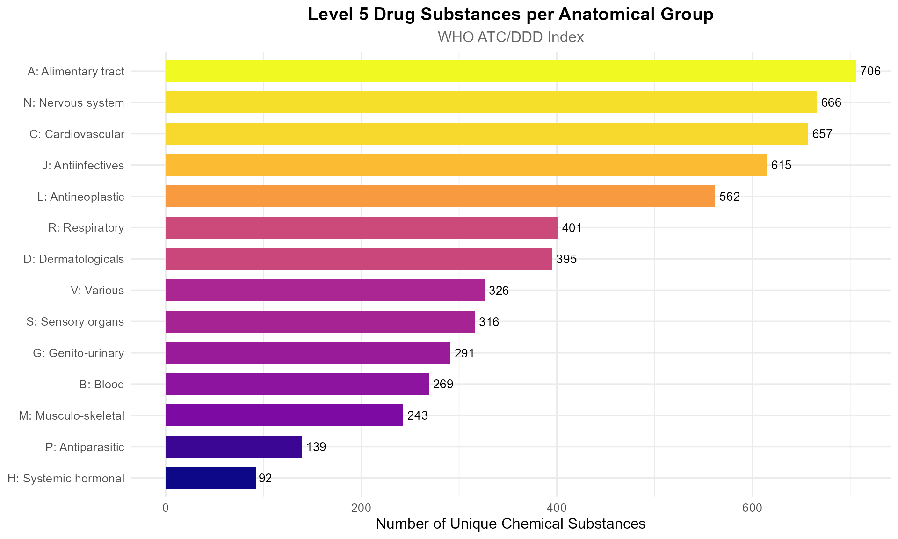
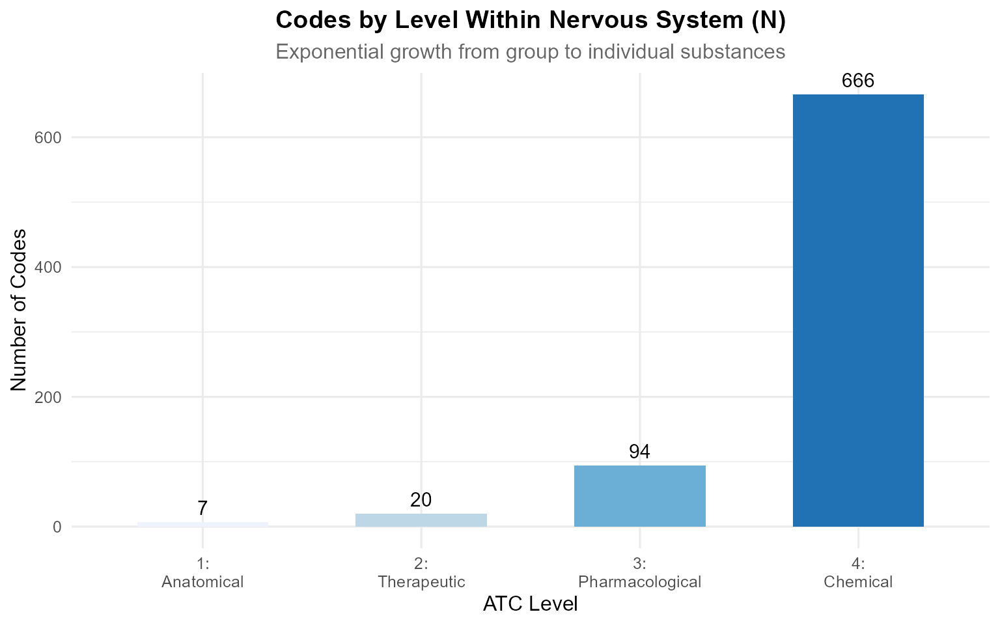

# Navigating the ATC Hierarchy

🧬

atcddd

WHO ATC/DDD Drug Classification Toolkit · v0.2.0

[WHO ATC/DDD Index](https://www.whocc.no/atc_ddd_index/)\
Pharmacoepidemiology · Drug Utilisation Research

↑

\+

−

⊙

×

‹

›


100 %

Scroll to zoom · Drag to pan · ← → to navigate

## Introduction

The ATC hierarchy is a five-level tree that classifies every drug from
broad anatomical group down to individual chemical substance. Navigating
this tree is essential for pharmacoepidemiology — you need to answer
questions like:

- *“Which drugs belong to the beta-blocker class?”*
- *“What are the children of the statin subclass?”*
- *“How many Level 5 substances are in the nervous system group?”*

This vignette shows you how to traverse, filter, and visualise the
hierarchy using `atcddd`.

``` r

library(atcddd)
library(dplyr)
library(ggplot2)
library(tidyr)
```

------------------------------------------------------------------------

## Loading the Offline Database

We start with the bundled WHO snapshot so everything works offline:

``` r

codes_path <- system.file("extdata", "WHO_ATC_codes_2026-07-14.csv",
                          package = "atcddd")
ddd_path   <- system.file("extdata", "WHO_ATC_DDD_2026-07-14.csv",
                          package = "atcddd")

atc_codes <- readr::read_csv(codes_path, show_col_types = FALSE)
atc_ddd   <- readr::read_csv(ddd_path, show_col_types = FALSE)

# Add level and parent columns using exported functions
atc_codes <- atc_codes %>%
  mutate(
    level       = atc_level(atc_code),
    parent_code = atc_parent(atc_code)
  )

cat(sprintf("Loaded %d codes across 5 levels", nrow(atc_codes)))
#> Loaded 6982 codes across 5 levels
```

------------------------------------------------------------------------

## Understanding ATC Levels

The five levels form a strict tree:

    Level 1:  C                   (1 char)      Cardiovascular system
    Level 2:  C10                 (3 chars)     Lipid modifying agents
    Level 3:  C10A                (4 chars)     Lipid modifying agents, plain
    Level 4:  C10AA               (5 chars)     HMG CoA reductase inhibitors
    Level 5:  C10AA01             (7 chars)     simvastatin

### Code Distribution by Level

``` r

atc_codes %>%
  count(level) %>%
  mutate(
    pct   = round(100 * n / sum(n), 1),
    label = case_when(
      level == 1 ~ "Anatomical main group",
      level == 2 ~ "Therapeutic subgroup",
      level == 3 ~ "Pharmacological subgroup",
      level == 4 ~ "Chemical subgroup",
      level == 5 ~ "Chemical substance"
    )
  ) %>%
  arrange(level) %>%
  select(label, n, pct)
#> # A tibble: 4 × 3
#>   label                        n   pct
#>   <chr>                    <int> <dbl>
#> 1 Therapeutic subgroup        94   1.3
#> 2 Pharmacological subgroup   271   3.9
#> 3 Chemical subgroup          939  13.4
#> 4 Chemical substance        5678  81.3
```

Level 5 (individual substances) dominates — each anatomical group fans
out into hundreds of specific drugs.

------------------------------------------------------------------------

## Finding Drugs by Therapeutic Class

### All Statins (HMG CoA Reductase Inhibitors, C10AA)

The most direct way to find a drug class is by its Level 4 code:

``` r

atc_codes %>%
  filter(grepl("^C10AA", atc_code)) %>%
  select(atc_code, atc_name, level)
#> # A tibble: 9 × 3
#>   atc_code atc_name                     level
#>   <chr>    <chr>                        <int>
#> 1 C10AA    HMG CoA reductase inhibitors     4
#> 2 C10AA01  simvastatin                      5
#> 3 C10AA02  lovastatin                       5
#> 4 C10AA03  pravastatin                      5
#> 5 C10AA04  fluvastatin                      5
#> 6 C10AA05  atorvastatin                     5
#> 7 C10AA06  cerivastatin                     5
#> 8 C10AA07  rosuvastatin                     5
#> 9 C10AA08  pitavastatin                     5
```

### All Beta-Blocking Agents (C07)

``` r

# Get all codes under C07
beta_blockers <- atc_codes %>%
  filter(grepl("^C07", atc_code))

# Show only Level 4 subgroups (chemical classes)
beta_blockers %>%
  filter(level == 4) %>%
  select(atc_code, atc_name)
#> # A tibble: 15 × 2
#>    atc_code atc_name                                                          
#>    <chr>    <chr>                                                             
#>  1 C07AA    Beta blocking agents, non-selective                               
#>  2 C07AB    Beta blocking agents, selective                                   
#>  3 C07AG    Alpha and beta blocking agents                                    
#>  4 C07BA    Beta blocking agents, non-selective, and thiazides                
#>  5 C07BB    Beta blocking agents, selective, and thiazides                    
#>  6 C07BG    Alpha and beta blocking agents and thiazides                      
#>  7 C07CA    Beta blocking agents, non-selective, and other diuretics          
#>  8 C07CB    Beta blocking agents, selective, and other diuretics              
#>  9 C07CG    Alpha and beta blocking agents and other diuretics                
#> 10 C07DA    Beta blocking agents, non-selective, thiazides and other diuretics
#> 11 C07DB    Beta blocking agents, selective, thiazides and other diuretics    
#> 12 C07EA    Beta blocking agents, non-selective, and vasodilators             
#> 13 C07EB    Beta blocking agents, selective, and vasodilators                 
#> 14 C07FB    Beta blocking agents and calcium channel blockers                 
#> 15 C07FX    Beta blocking agents, other combinations
```

### All Level 5 Substances Under a Parent

The new
[`atc_descendants()`](https://vanhungtran.github.io/atcddd/reference/atc_descendants.md)
function returns every code below a given parent:

``` r

# Every descendant under the statin chemical class (C10AA)
atc_descendants("C10AA", atc_codes)
#> [1] "C10AA01" "C10AA02" "C10AA03" "C10AA04" "C10AA05" "C10AA06" "C10AA07"
#> [8] "C10AA08"
```

You can also limit the depth with `max_level`:

``` r

# Under cardiovascular (C) but only down to Level 3
atc_descendants("C", atc_codes, max_level = 3)
#>  [1] "C01"  "C01A" "C01B" "C01C" "C01D" "C01E" "C02"  "C02A" "C02B" "C02C"
#> [11] "C02D" "C02K" "C02L" "C02N" "C03"  "C03A" "C03B" "C03C" "C03D" "C03E"
#> [21] "C03X" "C04"  "C04A" "C05"  "C05A" "C05B" "C05C" "C05X" "C07"  "C07A"
#> [31] "C07B" "C07C" "C07D" "C07E" "C07F" "C08"  "C08C" "C08D" "C08E" "C08G"
#> [41] "C09"  "C09A" "C09B" "C09C" "C09D" "C09X" "C10"  "C10A" "C10B"
```

------------------------------------------------------------------------

## Parent-Child Relationships

The exported functions
[`atc_level()`](https://vanhungtran.github.io/atcddd/reference/atc_level.md)
and
[`atc_parent()`](https://vanhungtran.github.io/atcddd/reference/atc_parent.md)
let you reconstruct the tree:

``` r

# Every code and its direct parent
atc_codes %>%
  filter(level >= 2) %>%
  select(atc_code, atc_name, level, parent_code) %>%
  head(10)
#> # A tibble: 10 × 4
#>    atc_code atc_name                                           level parent_code
#>    <chr>    <chr>                                              <int> <chr>      
#>  1 A01      STOMATOLOGICAL PREPARATIONS                            2 A          
#>  2 A01A     STOMATOLOGICAL PREPARATIONS                            3 A01        
#>  3 A01AA    Caries prophylactic agents                             4 A01A       
#>  4 A01AA01  sodium fluoride                                        5 A01AA      
#>  5 A01AA02  sodium monofluorophosphate                             5 A01AA      
#>  6 A01AA03  olaflur                                                5 A01AA      
#>  7 A01AA04  stannous fluoride                                      5 A01AA      
#>  8 A01AA30  combinations                                           5 A01AA      
#>  9 A01AA51  sodium fluoride, combinations                          5 A01AA      
#> 10 A01AB    Antiinfectives and antiseptics for local oral tre…     4 A01A
```

### Find All Children of a Specific Code

``` r

# Use the exported atc_children() function
atc_children("C10AA", atc_codes)
#> [1] "C10AA01" "C10AA02" "C10AA03" "C10AA04" "C10AA05" "C10AA06" "C10AA07"
#> [8] "C10AA08"
```

### Find the Full Ancestry of a Drug

``` r

trace_ancestry <- function(code) {
  parts <- list()
  current <- code
  while (!is.na(current) && current != "") {
    row <- atc_codes %>% filter(atc_code == current)
    if (nrow(row) == 0) break
    parts[[length(parts) + 1]] <- row
    current <- atc_parent(current)
  }
  bind_rows(rev(parts)) %>%
    select(atc_code, atc_name, level)
}

# Trace paracetamol from Level 1 down
trace_ancestry("N02BE01")
#> # A tibble: 4 × 3
#>   atc_code atc_name                          level
#>   <chr>    <chr>                             <int>
#> 1 N02      ANALGESICS                            2
#> 2 N02B     OTHER ANALGESICS AND ANTIPYRETICS     3
#> 3 N02BE    Anilides                              4
#> 4 N02BE01  paracetamol                           5
```

This ancestry trace is valuable for: - **Study inclusion criteria** —
“all analgesics except opioids” - **Pharmacovigilance** — signal
detection within a therapeutic class - **Drug utilisation** —
aggregating consumption by class

------------------------------------------------------------------------

## Working with the Live API

For up-to-date data, use
[`get_atc_hierarchy()`](https://vanhungtran.github.io/atcddd/reference/get_atc_hierarchy.md):

``` r

# Get the complete nervous-system hierarchy (live)
ns_tree <- get_atc_hierarchy("N", max_levels = 5)

# This returns the same enriched structure
ns_tree %>%
  select(atc_code, atc_name, level, parent_code, has_children) %>%
  head(10)
```

[`get_atc_hierarchy()`](https://vanhungtran.github.io/atcddd/reference/get_atc_hierarchy.md)
adds a `has_children` column — `TRUE` if the code has any
sub-classifications, which is useful for building interactive tree
widgets.

------------------------------------------------------------------------

## Comparing Therapeutic Classes

### How Many Drugs in Each Group?

``` r

# Count Level 5 substances per Level 1 anatomical group
atc_codes %>%
  filter(level == 5) %>%
  mutate(anatomical_group = substr(atc_code, 1, 1)) %>%
  count(anatomical_group, sort = TRUE) %>%
  rename(n_substances = n)
#> # A tibble: 14 × 2
#>    anatomical_group n_substances
#>    <chr>                   <int>
#>  1 A                         706
#>  2 N                         666
#>  3 C                         657
#>  4 J                         615
#>  5 L                         562
#>  6 R                         401
#>  7 D                         395
#>  8 V                         326
#>  9 S                         316
#> 10 G                         291
#> 11 B                         269
#> 12 M                         243
#> 13 P                         139
#> 14 H                          92
```

Groups J (antiinfectives), N (nervous system), and A (alimentary tract)
are the largest — reflecting decades of drug development in those
therapeutic areas.

------------------------------------------------------------------------

## Visualising the Hierarchy

### Treemap of ATC Level 1 Groups

``` r

atc_codes %>%
  filter(level == 5) %>%
  mutate(group = substr(atc_code, 1, 1)) %>%
  count(group, sort = TRUE) %>%
  mutate(
    group_label = case_when(
      group == "A" ~ "A: Alimentary tract",
      group == "B" ~ "B: Blood",
      group == "C" ~ "C: Cardiovascular",
      group == "D" ~ "D: Dermatologicals",
      group == "G" ~ "G: Genito-urinary",
      group == "H" ~ "H: Systemic hormonal",
      group == "J" ~ "J: Antiinfectives",
      group == "L" ~ "L: Antineoplastic",
      group == "M" ~ "M: Musculo-skeletal",
      group == "N" ~ "N: Nervous system",
      group == "P" ~ "P: Antiparasitic",
      group == "R" ~ "R: Respiratory",
      group == "S" ~ "S: Sensory organs",
      group == "V" ~ "V: Various",
      TRUE        ~ group
    )
  ) %>%
  ggplot(aes(x = reorder(group_label, n), y = n, fill = n)) +
  geom_col(width = 0.7) +
  geom_text(aes(label = n), hjust = -0.2, size = 3.5) +
  scale_fill_viridis_c(option = "plasma", guide = "none") +
  coord_flip() +
  labs(
    title    = "Level 5 Drug Substances per Anatomical Group",
    subtitle = "WHO ATC/DDD Index",
    x        = NULL,
    y        = "Number of Unique Chemical Substances"
  ) +
  theme_minimal(base_size = 12) +
  theme(
    plot.title    = element_text(face = "bold", hjust = 0.5),
    plot.subtitle = element_text(hjust = 0.5, color = "grey40")
  )
```



### Hierarchy Depth Within a Branch

``` r

# Count codes at each level within Nervous System (N)
atc_codes %>%
  filter(grepl("^N", atc_code)) %>%
  count(level) %>%
  mutate(level_label = case_when(
    level == 1 ~ "1: Anatomical",
    level == 2 ~ "2: Therapeutic",
    level == 3 ~ "3: Pharmacological",
    level == 4 ~ "4: Chemical",
    level == 5 ~ "5: Substance"
  )) %>%
  ggplot(aes(x = factor(level), y = n, fill = factor(level))) +
  geom_col(width = 0.6) +
  geom_text(aes(label = n), vjust = -0.5, size = 4) +
  scale_fill_brewer(palette = "Blues", guide = "none") +
  scale_x_discrete(labels = c(
    "1:\nAnatomical", "2:\nTherapeutic", "3:\nPharmacological",
    "4:\nChemical", "5:\nSubstance"
  )) +
  labs(
    title    = "Codes by Level Within Nervous System (N)",
    subtitle = "Exponential growth from group to individual substances",
    x        = "ATC Level",
    y        = "Number of Codes"
  ) +
  theme_minimal(base_size = 12) +
  theme(
    plot.title    = element_text(face = "bold", hjust = 0.5),
    plot.subtitle = element_text(hjust = 0.5, color = "grey40")
  )
```



------------------------------------------------------------------------

## Practical Recipes

### Recipe 1: Find Every Drug in a Therapeutic Subgroup

``` r

# All Level 5 drugs under proton-pump inhibitors (A02BC)
atc_crawl(roots = "A02BC")$codes %>%
  filter(nchar(atc_code) == 7) %>%
  select(atc_code, atc_name)
```

### Recipe 2: Build a Complete Class-to-Drug Map

``` r

# Map: every Level 4 chemical class → all Level 5 substances in it
class_to_drug <- atc_codes %>%
  filter(level == 5) %>%
  mutate(chemical_class = substr(atc_code, 1, 5)) %>%
  select(chemical_class, substance_code = atc_code, substance_name = atc_name)

# Which chemical classes contain "fluoroquinolone"?
atc_codes %>%
  filter(level == 4, grepl("fluoroquinolone", atc_name, ignore.case = TRUE)) %>%
  inner_join(class_to_drug, by = c("atc_code" = "chemical_class")) %>%
  select(chemical_class = atc_code, class_name = atc_name,
         substance_code, substance_name)
#> # A tibble: 33 × 4
#>    chemical_class class_name       substance_code substance_name
#>    <chr>          <chr>            <chr>          <chr>         
#>  1 J01MA          Fluoroquinolones J01MA01        ofloxacin     
#>  2 J01MA          Fluoroquinolones J01MA02        ciprofloxacin 
#>  3 J01MA          Fluoroquinolones J01MA03        pefloxacin    
#>  4 J01MA          Fluoroquinolones J01MA04        enoxacin      
#>  5 J01MA          Fluoroquinolones J01MA05        temafloxacin  
#>  6 J01MA          Fluoroquinolones J01MA06        norfloxacin   
#>  7 J01MA          Fluoroquinolones J01MA07        lomefloxacin  
#>  8 J01MA          Fluoroquinolones J01MA08        fleroxacin    
#>  9 J01MA          Fluoroquinolones J01MA09        sparfloxacin  
#> 10 J01MA          Fluoroquinolones J01MA10        rufloxacin    
#> # ℹ 23 more rows
```

### Recipe 3: Check If a Drug Belongs to a Class

``` r

drug_in_class <- function(code, class_prefix) {
  grepl(paste0("^", class_prefix), code)
}

# Is atorvastatin a cardiovascular drug?
drug_in_class("C10AA05", "C")  # TRUE
#> [1] TRUE

# Is it an antiinfective?
drug_in_class("C10AA05", "J")  # FALSE
#> [1] FALSE
```

------------------------------------------------------------------------

## Key Takeaways

1.  **Every ATC code is a node in a strict 5-level tree** — parent-child
    relationships are deterministic from the code structure.

2.  **Use
    [`get_atc_hierarchy()`](https://vanhungtran.github.io/atcddd/reference/get_atc_hierarchy.md)
    for live data** and
    [`atc_level()`](https://vanhungtran.github.io/atcddd/reference/atc_level.md)
    /
    [`atc_parent()`](https://vanhungtran.github.io/atcddd/reference/atc_parent.md)
    for offline computation on cached data.

3.  **Level 4 (chemical class) is the sweet spot** for
    pharmacoepidemiology — it groups drugs by mechanism, which is
    clinically meaningful.

4.  **Level 5 (substance) is where DDD values live** — DDDs are assigned
    to individual substances, not to classes.

------------------------------------------------------------------------

## Session Information

``` r

sessionInfo()
#> R version 4.5.0 (2025-04-11 ucrt)
#> Platform: x86_64-w64-mingw32/x64
#> Running under: Windows 11 x64 (build 26200)
#> 
#> Matrix products: default
#>   LAPACK version 3.12.1
#> 
#> locale:
#> [1] LC_COLLATE=English_United States.utf8 
#> [2] LC_CTYPE=English_United States.utf8   
#> [3] LC_MONETARY=English_United States.utf8
#> [4] LC_NUMERIC=C                          
#> [5] LC_TIME=English_United States.utf8    
#> 
#> time zone: Europe/Zurich
#> tzcode source: internal
#> 
#> attached base packages:
#> [1] stats     graphics  grDevices utils     datasets  methods   base     
#> 
#> other attached packages:
#> [1] tidyr_1.3.2   ggplot2_4.0.3 dplyr_1.2.1   atcddd_0.2.0 
#> 
#> loaded via a namespace (and not attached):
#>  [1] utf8_1.2.6         sass_0.4.10        generics_0.1.4     stringi_1.8.7     
#>  [5] hms_1.1.4          digest_0.6.39      magrittr_2.0.5     evaluate_1.0.5    
#>  [9] grid_4.5.0         RColorBrewer_1.1-3 fastmap_1.2.0      jsonlite_2.0.0    
#> [13] purrr_1.2.2        viridisLite_0.4.3  scales_1.4.0       textshaping_1.0.5 
#> [17] jquerylib_0.1.4    cli_3.6.5          rlang_1.2.0        crayon_1.5.3      
#> [21] bit64_4.8.0        withr_3.0.2        cachem_1.1.0       yaml_2.3.12       
#> [25] otel_0.2.0         tools_4.5.0        parallel_4.5.0     tzdb_0.5.0        
#> [29] memoise_2.0.1      vctrs_0.7.3        R6_2.6.1           lifecycle_1.0.5   
#> [33] stringr_1.6.0      fs_2.1.0           htmlwidgets_1.6.4  bit_4.6.0         
#> [37] vroom_1.7.1        ragg_1.5.2         pkgconfig_2.0.3    desc_1.4.3        
#> [41] pkgdown_2.2.0      pillar_1.11.1      bslib_0.10.0       gtable_0.3.6      
#> [45] glue_1.8.1         systemfonts_1.3.2  xfun_0.57          tibble_3.3.1      
#> [49] tidyselect_1.2.1   knitr_1.51         dichromat_2.0-0.1  farver_2.1.2      
#> [53] htmltools_0.5.9    labeling_0.4.3     rmarkdown_2.31     readr_2.2.0       
#> [57] compiler_4.5.0     S7_0.2.2
```
