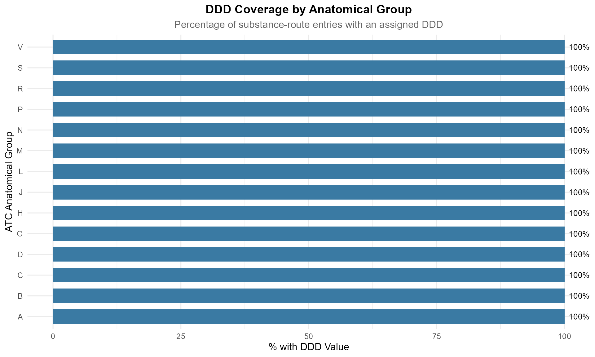

# Working with Defined Daily Doses (DDD)

🧬

atcddd

WHO ATC/DDD Drug Classification Toolkit · v0.2.0

[WHO ATC/DDD Index](https://www.whocc.no/atc_ddd_index/)\
Pharmacoepidemiology · Drug Utilisation Research

↑

\+

−

⊙

×

‹

›


100 %

Scroll to zoom · Drag to pan · ← → to navigate

## Introduction

The **Defined Daily Dose (DDD)** is the cornerstone of quantitative drug
utilisation research. It is the assumed average maintenance dose per day
for a drug used for its main indication in adults.

> ⚠️ **The DDD is a technical unit of measurement — not a clinical
> recommendation.** It enables comparisons across drugs, regions, and
> time, but does not tell you what to prescribe for an individual
> patient.

This vignette covers:

- Understanding DDD values and why many are missing
- Analysing DDD coverage across drug classes
- Computing DDDs from real prescription data
- Comparing DDDs across administration routes
- Common pitfalls and how to avoid them

``` r

library(atcddd)
library(dplyr)
library(ggplot2)
library(tidyr)
library(stringr)
```

------------------------------------------------------------------------

## Loading the Data

``` r

codes_path <- system.file("extdata", "WHO_ATC_codes_2026-07-14.csv",
                          package = "atcddd")
ddd_path   <- system.file("extdata", "WHO_ATC_DDD_2026-07-14.csv",
                          package = "atcddd")

atc_codes <- readr::read_csv(codes_path, show_col_types = FALSE)
atc_ddd   <- readr::read_csv(ddd_path, show_col_types = FALSE)

cat(sprintf("Loaded %d DDD entries across %d unique substances",
            nrow(atc_ddd),
            n_distinct(atc_ddd$atc_code)))
#> Loaded 6218 DDD entries across 5680 unique substances
```

------------------------------------------------------------------------

## Understanding the DDD Table

The DDD table has a specific structure:

| Column | Description | Example |
|----|----|----|
| `source_code` | The Level 4 parent page from which the DDD was parsed | `N02BE` |
| `atc_code` | The Level 5 substance code | `N02BE01` |
| `atc_name` | Substance name | `paracetamol` |
| `ddd` | Defined Daily Dose value | `3` |
| `uom` | Unit of measurement | `g` |
| `adm_r` | Route of administration | `O` (oral) |
| `note` | Additional WHO notes | \`\` |

The **same substance** can have **multiple DDD entries** — one for each
route of administration:

``` r

# Drugs with multiple administration routes
atc_ddd %>%
  count(atc_code, sort = TRUE) %>%
  filter(n > 1) %>%
  head(10) %>%
  left_join(distinct(atc_ddd, atc_code, atc_name), by = "atc_code") %>%
  select(atc_code, atc_name, n_routes = n)
#> # A tibble: 10 × 3
#>    atc_code atc_name             n_routes
#>    <chr>    <chr>                   <int>
#>  1 G03CA03  estradiol                  10
#>  2 G03BA03  testosterone                6
#>  3 N02CA02  ergotamine                  5
#>  4 N07BA01  nicotine                    5
#>  5 C01DA02  glyceryl trinitrate         4
#>  6 C01DA08  isosorbide dinitrate        4
#>  7 G03DA04  progesterone                4
#>  8 H01BA02  desmopressin                4
#>  9 N02CC01  sumatriptan                 4
#> 10 N05AB03  perphenazine                4
```

Paracetamol appears with 4 routes — oral (O), parenteral (P), rectal
(R), and others — each with its own DDD value.

------------------------------------------------------------------------

## DDD Availability: What to Expect

### By Anatomical Group

``` r

atc_ddd %>%
  filter(!is.na(adm_r), adm_r != "NA", adm_r != "") %>%
  mutate(anatomical_group = substr(atc_code, 1, 1)) %>%
  group_by(anatomical_group) %>%
  summarise(
    total_entries  = n(),
    with_ddd       = sum(!is.na(ddd) & ddd != "NA"),
    without_ddd    = sum(is.na(ddd) | ddd == "NA"),
    pct_with_ddd   = round(100 * with_ddd / total_entries, 1),
    .groups = "drop"
  ) %>%
  arrange(pct_with_ddd)
#> # A tibble: 14 × 5
#>    anatomical_group total_entries with_ddd without_ddd pct_with_ddd
#>    <chr>                    <int>    <int>       <int>        <dbl>
#>  1 A                          355      355           0          100
#>  2 B                          117      117           0          100
#>  3 C                          344      344           0          100
#>  4 D                           16       16           0          100
#>  5 G                          165      165           0          100
#>  6 H                           80       80           0          100
#>  7 J                          422      422           0          100
#>  8 L                          249      249           0          100
#>  9 M                          148      148           0          100
#> 10 N                          523      523           0          100
#> 11 P                           59       59           0          100
#> 12 R                          254      254           0          100
#> 13 S                            7        7           0          100
#> 14 V                           21       21           0          100
```

### Visualising DDD Coverage

``` r

atc_ddd %>%
  filter(!is.na(adm_r), adm_r != "NA", adm_r != "") %>%
  mutate(
    anatomical_group = substr(atc_code, 1, 1),
    has_ddd = !is.na(ddd) & ddd != "NA"
  ) %>%
  count(anatomical_group, has_ddd) %>%
  group_by(anatomical_group) %>%
  mutate(pct = round(100 * n / sum(n), 1)) %>%
  ungroup() %>%
  filter(has_ddd) %>%
  ggplot(aes(x = reorder(anatomical_group, pct), y = pct, fill = pct)) +
  geom_col(width = 0.7) +
  geom_text(aes(label = paste0(pct, "%")), hjust = -0.2, size = 3.5) +
  scale_fill_viridis_c(option = "mako", direction = -1, guide = "none") +
  coord_flip(ylim = c(0, 100)) +
  labs(
    title    = "DDD Coverage by Anatomical Group",
    subtitle = "Percentage of substance-route entries with an assigned DDD",
    x        = "ATC Anatomical Group",
    y        = "% with DDD Value"
  ) +
  theme_minimal(base_size = 12) +
  theme(
    plot.title    = element_text(face = "bold", hjust = 0.5),
    plot.subtitle = element_text(hjust = 0.5, color = "grey40")
  )
```



**Interpretation**:

- **High coverage (\>70%)**: Systemic drugs — antiinfectives (J),
  cardiovascular (C), nervous system (N). These have well-defined daily
  doses.
- **Low coverage (\<30%)**: Topicals (D), sensory organs (S) — dosing is
  patient-specific and depends on treated area or condition severity.

------------------------------------------------------------------------

## Why DDDs Are Missing

The WHO deliberately **withholds** DDDs for specific categories. This is
not a data quality issue — it is by design.

``` r

# Categorise the nature of missing DDDs
atc_ddd %>%
  mutate(has_ddd = !is.na(ddd) & ddd != "NA") %>%
  count(has_ddd) %>%
  mutate(pct = round(100 * n / sum(n), 1))
#> # A tibble: 2 × 3
#>   has_ddd     n   pct
#>   <lgl>   <int> <dbl>
#> 1 FALSE    3450  55.5
#> 2 TRUE     2768  44.5
```

#### Categories That Typically Lack DDDs

| Category | Example Codes | Reason |
|----|----|----|
| **Topical preparations** | D01-D07 | Variable absorption; dose depends on body surface area |
| **Fixed-dose combinations** | Codes ending in digits (e.g., C09BA02) | WHO policy: no DDD for combination products |
| **Ophthalmics / otics** | S01-S03 | Local application, minimal systemic absorption |
| **Vaccines** | J07 | Prophylactic, not daily dosing |
| **Contrast media** | V08 | Diagnostic use, not therapeutic |
| **Herbal / alternative** | Various | Lack of standardised active ingredient quantities |

------------------------------------------------------------------------

## Computing DDDs from Prescription Data

This is the core pharmacoepidemiology use case: you have prescription
records with drug codes, quantities, and strengths, and you need DDDs
per patient.

### The Formula

``` math
\text{Number of DDDs} = \frac{\text{Quantity} \times \text{Strength per unit}}{\text{DDD value (in same unit)}}
```

### Worked Example

``` r

# Example: prescription records for 3 patients
prescriptions <- tibble(
  patient_id = c(1, 1, 2, 3, 3),
  atc_code   = c("N02BE01", "C10AA05", "N02BE01", "A02BC01", "C10AA05"),
  quantity   = c(30, 30, 60, 28, 90),       # tablets/capsules
  strength   = c(500, 20, 500, 20, 40),      # mg per unit
  unit       = c("mg", "mg", "mg", "mg", "mg")
)

# Join with DDD data (using the oral route, adm_r = "O")
ddd_ref <- atc_ddd %>%
  filter(!is.na(ddd), ddd != "NA", adm_r == "O") %>%
  select(atc_code, atc_name, ddd, uom) %>%
  mutate(ddd_value = as.numeric(ddd))

prescriptions %>%
  left_join(ddd_ref, by = "atc_code") %>%
  mutate(
    # Convert DDD to mg if needed
    ddd_mg = case_when(
      uom == "g"  ~ ddd_value * 1000,
      uom == "mg" ~ ddd_value,
      uom == "mcg" ~ ddd_value / 1000,
      TRUE        ~ NA_real_
    ),
    total_mg   = quantity * strength,
    n_ddd      = total_mg / ddd_mg
  ) %>%
  select(patient_id, atc_code, atc_name, quantity, strength,
         total_mg, ddd_mg, n_ddd)
#> # A tibble: 5 × 8
#>   patient_id atc_code atc_name     quantity strength total_mg ddd_mg n_ddd
#>        <dbl> <chr>    <chr>           <dbl>    <dbl>    <dbl>  <dbl> <dbl>
#> 1          1 N02BE01  paracetamol        30      500    15000   3000     5
#> 2          1 C10AA05  atorvastatin       30       20      600     20    30
#> 3          2 N02BE01  paracetamol        60      500    30000   3000    10
#> 4          3 A02BC01  omeprazole         28       20      560     20    28
#> 5          3 C10AA05  atorvastatin       90       40     3600     20   180
```

### Aggregate by Patient

``` r

prescriptions %>%
  left_join(
    atc_ddd %>%
      filter(!is.na(ddd), ddd != "NA", adm_r == "O") %>%
      mutate(ddd_value = as.numeric(ddd)) %>%
      select(atc_code, atc_name, ddd_value, uom),
    by = "atc_code"
  ) %>%
  mutate(
    ddd_mg = case_when(
      uom == "g"   ~ ddd_value * 1000,
      uom == "mg"  ~ ddd_value,
      uom == "mcg" ~ ddd_value / 1000,
      TRUE         ~ NA_real_
    ),
    total_mg = quantity * strength,
    n_ddd    = total_mg / ddd_mg
  ) %>%
  group_by(patient_id) %>%
  summarise(
    n_drugs    = n(),
    total_ddds = sum(n_ddd, na.rm = TRUE),
    .groups    = "drop"
  )
#> # A tibble: 3 × 3
#>   patient_id n_drugs total_ddds
#>        <dbl>   <int>      <dbl>
#> 1          1       2         35
#> 2          2       1         10
#> 3          3       2        208
```

------------------------------------------------------------------------

## DDD per 1000 Inhabitants per Day (DID)

The standard population-level metric in drug utilisation research:

``` math
\text{DID} = \frac{\text{Total DDDs consumed in period}}{\text{Population} \times \text{Days in period}} \times 1000
```

``` r

# Hypothetical: national paracetamol consumption over 1 year
total_paracetamol_ddds <- 850000000  # 850 million DDDs
population             <- 68000000    # 68 million inhabitants
days_in_year           <- 365

did <- (total_paracetamol_ddds / (population * days_in_year)) * 1000
cat(sprintf("Paracetamol DID: %.1f DDD per 1000 inhabitants per day", did))
#> Paracetamol DID: 34.2 DDD per 1000 inhabitants per day
```

A DID of 34.3 means that, on any given day, approximately 34 out of
every 1000 people in the population use one DDD of paracetamol.

------------------------------------------------------------------------

## DDD by Route of Administration

Different routes often have different DDDs for the same drug:

``` r

atc_ddd %>%
  filter(!is.na(ddd), ddd != "NA", !is.na(adm_r), adm_r != "NA", adm_r != "") %>%
  mutate(
    adm_label = case_when(
      adm_r == "O"    ~ "Oral",
      adm_r == "P"    ~ "Parenteral",
      adm_r == "R"    ~ "Rectal",
      adm_r == "N"    ~ "Nasal",
      adm_r == "SL"   ~ "Sublingual",
      adm_r == "TD"   ~ "Transdermal",
      adm_r == "Inhal" ~ "Inhalation",
      adm_r == "V"    ~ "Vaginal",
      TRUE            ~ adm_r
    )
  ) %>%
  count(adm_label, sort = TRUE) %>%
  mutate(pct = round(100 * n / sum(n), 1)) %>%
  head(10)
#> # A tibble: 10 × 3
#>    adm_label          n   pct
#>    <chr>          <int> <dbl>
#>  1 Oral            1670  60.5
#>  2 Parenteral       817  29.6
#>  3 Rectal            79   2.9
#>  4 Nasal             38   1.4
#>  5 Vaginal           37   1.3
#>  6 Inhal.solution    25   0.9
#>  7 Inhal.aerosol     23   0.8
#>  8 Inhal.powder      23   0.8
#>  9 Sublingual        16   0.6
#> 10 Transdermal       14   0.5
```

Oral (O) and parenteral (P) routes dominate the DDD assignments —
reflecting the systemic drugs for which DDDs are most useful.

------------------------------------------------------------------------

## Cross-Referencing DDDs With Chemical Classes

### Average DDD by Therapeutic Class

``` r

# Join DDD data with Level 4 classification
atc_ddd %>%
  filter(!is.na(ddd), ddd != "NA", adm_r == "O") %>%
  mutate(
    ddd_value  = as.numeric(ddd),
    class_code = substr(atc_code, 1, 5)   # Level 4 chemical class
  ) %>%
  group_by(class_code) %>%
  summarise(
    n_drugs        = n_distinct(atc_code),
    mean_ddd       = mean(ddd_value, na.rm = TRUE),
    median_ddd     = median(ddd_value, na.rm = TRUE),
    min_ddd        = min(ddd_value, na.rm = TRUE),
    max_ddd        = max(ddd_value, na.rm = TRUE),
    .groups        = "drop"
  ) %>%
  left_join(
    atc_codes %>% filter(nchar(atc_code) == 5) %>% select(atc_code, class_name = atc_name),
    by = c("class_code" = "atc_code")
  ) %>%
  filter(n_drugs >= 3) %>%
  arrange(desc(mean_ddd)) %>%
  select(class_code, class_name, n_drugs, mean_ddd, median_ddd) %>%
  head(10)
#> # A tibble: 10 × 5
#>    class_code class_name                             n_drugs mean_ddd median_ddd
#>    <chr>      <chr>                                    <int>    <dbl>      <dbl>
#>  1 C04AA      2-amino-1-phenylethanol derivatives          3     55         60  
#>  2 N07CA      Antivertigo preparations                     4     53.5       57  
#>  3 A04AD      Other antiemetics                            4     45.8        9  
#>  4 L01EE      Mitogen-activated protein kinase (MEK…       3     45.7       45  
#>  5 N05AE      Indole derivatives                           5     41.2       50  
#>  6 L01EB      Epidermal growth factor receptor (EGF…       6     40.9       42.5
#>  7 B03AB      Iron trivalent, oral preparations            6     38.5       30.4
#>  8 R05DB      Other cough suppressants                    15     37.5       25  
#>  9 C03DA      Aldosterone antagonists                      3     35.8       37.5
#> 10 C01DA      Organic nitrates                             7     35.0       30
```

Large differences in mean DDD across classes reflect real
pharmacological differences — antibiotics need grams per day, while
potent drugs like ACE inhibitors need milligrams.

------------------------------------------------------------------------

## DDD Unit Distribution

``` r

# What units do DDDs use?
atc_ddd %>%
  filter(!is.na(ddd), ddd != "NA", !is.na(uom), uom != "NA", uom != "") %>%
  count(uom, sort = TRUE) %>%
  mutate(pct = round(100 * n / sum(n), 1))
#> # A tibble: 10 × 3
#>    uom        n   pct
#>    <chr>  <int> <dbl>
#>  1 g       1331  48.1
#>  2 mg      1278  46.2
#>  3 U         58   2.1
#>  4 mcg       54   2  
#>  5 TU        19   0.7
#>  6 MU        14   0.5
#>  7 ml         8   0.3
#>  8 LSU        2   0.1
#>  9 tablet     2   0.1
#> 10 mmol       1   0
```

The three most common DDD units are:

| Unit | Typical for | Example |
|----|----|----|
| **g** (grams) | Antibiotics, analgesics, old drugs with high doses | amoxicillin: 1.5 g |
| **mg** (milligrams) | Modern drugs with lower effective doses | atorvastatin: 20 mg |
| **mcg** (micrograms) | Highly potent drugs | levothyroxine: 150 mcg |

------------------------------------------------------------------------

## Common Pitfalls

#### 1. Ignoring Route of Administration

``` r

# Paracetamol has different DDDs for different routes
atc_ddd %>%
  filter(atc_code == "N02BE01", !is.na(ddd), ddd != "NA") %>%
  select(atc_code, atc_name, ddd, uom, adm_r)
#> # A tibble: 3 × 5
#>   atc_code atc_name      ddd uom   adm_r
#>   <chr>    <chr>       <dbl> <chr> <chr>
#> 1 N02BE01  paracetamol     3 g     O    
#> 2 N02BE01  paracetamol     3 g     P    
#> 3 N02BE01  paracetamol     3 g     R
```

If you compute DDDs assuming the oral route when patients received IV
paracetamol, your numbers will be wrong. Always match on `adm_r`.

#### 2. Unit Mismatches

A DDD of 3 g paired with tablets of 500 mg requires unit conversion:

``` r

ddd_g  <- 3
ddd_mg <- ddd_g * 1000  # 3000 mg
tablets_per_ddd <- ddd_mg / 500  # 6 tablets per DDD
```

#### 3. Assuming All Drugs Have DDDs

As shown above, ~40-50% of DDD entries are deliberately `NA`. Always
check coverage before reporting — if topical drugs dominate your
dataset, DDD-based metrics may be misleading.

#### 4. Using DDD as a Clinical Dose

> The DDD is **not** a recommended or prescribed dose. It is a technical
> measurement unit. Individual patients may need very different doses.

------------------------------------------------------------------------

## Live DDD Retrieval

For the latest DDD values, use the live API:

``` r

# Get current DDD data for a drug from WHO
aspirin_live <- get_atc_data("N02BA01")
aspirin_live %>% select(atc_code, atc_name, ddd, uom, adm_r, note)
```

------------------------------------------------------------------------

## Key Takeaways

1.  **DDDs enable apples-to-apples comparisons** — they normalise drug
    consumption across different strengths, package sizes, and
    formulations.

2.  **Match by route of administration** (`adm_r`) — the same drug can
    have different DDDs for oral, parenteral, and rectal routes.

3.  **Convert units carefully** — DDDs come in g, mg, mcg, TU, MU, and
    other units. Always convert to a common unit before computing total
    DDDs.

4.  **Document missing DDDs** — if 40% of your study drugs lack DDDs,
    report it. Transparency about coverage is more important than
    perfect coverage.

5.  **DDD ≠ clinical dose** — use DDD for population-level comparisons,
    not individual patient management.

------------------------------------------------------------------------

## Session Information

``` r

sessionInfo()
#> R version 4.5.0 (2025-04-11 ucrt)
#> Platform: x86_64-w64-mingw32/x64
#> Running under: Windows 11 x64 (build 26200)
#> 
#> Matrix products: default
#>   LAPACK version 3.12.1
#> 
#> locale:
#> [1] LC_COLLATE=English_United States.utf8 
#> [2] LC_CTYPE=English_United States.utf8   
#> [3] LC_MONETARY=English_United States.utf8
#> [4] LC_NUMERIC=C                          
#> [5] LC_TIME=English_United States.utf8    
#> 
#> time zone: Europe/Zurich
#> tzcode source: internal
#> 
#> attached base packages:
#> [1] stats     graphics  grDevices utils     datasets  methods   base     
#> 
#> other attached packages:
#> [1] stringr_1.6.0 tidyr_1.3.2   ggplot2_4.0.3 dplyr_1.2.1   atcddd_0.2.0 
#> 
#> loaded via a namespace (and not attached):
#>  [1] utf8_1.2.6         sass_0.4.10        generics_0.1.4     stringi_1.8.7     
#>  [5] hms_1.1.4          digest_0.6.39      magrittr_2.0.5     evaluate_1.0.5    
#>  [9] grid_4.5.0         RColorBrewer_1.1-3 fastmap_1.2.0      jsonlite_2.0.0    
#> [13] purrr_1.2.2        viridisLite_0.4.3  scales_1.4.0       textshaping_1.0.5 
#> [17] jquerylib_0.1.4    cli_3.6.5          crayon_1.5.3       rlang_1.2.0       
#> [21] bit64_4.8.0        withr_3.0.2        cachem_1.1.0       yaml_2.3.12       
#> [25] otel_0.2.0         parallel_4.5.0     tools_4.5.0        tzdb_0.5.0        
#> [29] memoise_2.0.1      vctrs_0.7.3        R6_2.6.1           lifecycle_1.0.5   
#> [33] fs_2.1.0           htmlwidgets_1.6.4  bit_4.6.0          vroom_1.7.1       
#> [37] ragg_1.5.2         pkgconfig_2.0.3    desc_1.4.3         pkgdown_2.2.0     
#> [41] pillar_1.11.1      bslib_0.10.0       gtable_0.3.6       glue_1.8.1        
#> [45] systemfonts_1.3.2  xfun_0.57          tibble_3.3.1       tidyselect_1.2.1  
#> [49] knitr_1.51         dichromat_2.0-0.1  farver_2.1.2       htmltools_0.5.9   
#> [53] labeling_0.4.3     rmarkdown_2.31     readr_2.2.0        compiler_4.5.0    
#> [57] S7_0.2.2
```
