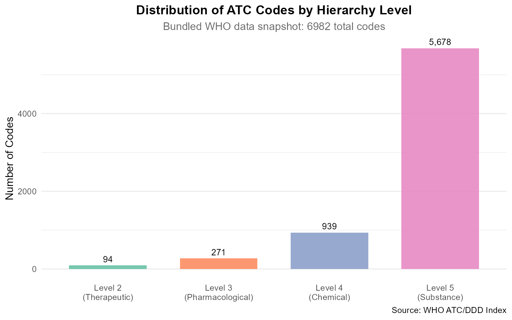

# Getting Started with atcddd

🧬

atcddd

WHO ATC/DDD Drug Classification Toolkit · v0.2.0

[WHO ATC/DDD Index](https://www.whocc.no/atc_ddd_index/)\
Pharmacoepidemiology · Drug Utilisation Research

↑

\+

−

⊙

×

‹

›


100 %

Scroll to zoom · Drag to pan · ← → to navigate

## Introduction

The **atcddd** package provides comprehensive tools for working with the
World Health Organization’s **Anatomical Therapeutic Chemical (ATC)
Classification System** and **Defined Daily Dose (DDD)** values. Whether
you need to crawl the latest WHO data, validate ATC codes, navigate the
five-level drug hierarchy, or compute DDD metrics from prescription
records — `atcddd` gives you tidy, reproducible workflows in R.

### What is the ATC Classification System?

The ATC system divides drugs into five levels of increasing specificity:

| Level | Name | Example code | Example name |
|----|----|----|----|
| 1 | Anatomical main group | `N` | Nervous system |
| 2 | Therapeutic subgroup | `N02` | Analgesics |
| 3 | Pharmacological subgroup | `N02B` | Other analgesics and antipyretics |
| 4 | Chemical subgroup | `N02BE` | Anilides |
| 5 | Chemical substance | `N02BE01` | paracetamol |

### What is the Defined Daily Dose (DDD)?

The DDD is the assumed average maintenance dose per day for a drug used
for its main indication in adults. It is a unit of measurement, **not**
a recommended dose. DDDs enable researchers to compare drug utilisation
across populations, regions, and time periods — even when drugs come in
different strengths and package sizes.

------------------------------------------------------------------------

## Quick Start

### Loading the Package

``` r

library(atcddd)
library(dplyr)
library(ggplot2)
```

### The 14 Main Anatomical Groups

The ATC system starts with 14 single-letter groups. Use
[`atc_roots_default()`](https://vanhungtran.github.io/atcddd/reference/atc_roots_default.md)
to list them:

``` r

roots <- atc_roots_default()
roots
#>  [1] "A" "B" "C" "D" "G" "H" "J" "L" "M" "N" "P" "R" "S" "V"
```

### Validate Any ATC Code

[`is_valid_atc_code()`](https://vanhungtran.github.io/atcddd/reference/is_valid_atc_code.md)
checks whether a string conforms to the official ATC format:

``` r

# Valid codes at each level
is_valid_atc_code("N")          # Level 1 — TRUE
#> [1] TRUE
is_valid_atc_code("N02")        # Level 2 — TRUE
#> [1] TRUE
is_valid_atc_code("N02BE01")    # Level 5 — TRUE
#> [1] TRUE

# Invalid codes
is_valid_atc_code("n02be01")    # lowercase — FALSE
#> [1] FALSE
is_valid_atc_code("N02-BE01")   # hyphens  — FALSE
#> [1] FALSE
is_valid_atc_code("N02BE011")   # too long — FALSE
#> [1] FALSE
is_valid_atc_code("ZZZ")        # bad pattern — FALSE
#> [1] FALSE
```

------------------------------------------------------------------------

## Retrieving ATC Data

### High-Level API (Recommended)

The
[`get_atc_data()`](https://vanhungtran.github.io/atcddd/reference/get_atc_data.md)
function provides a clean interface to the WHO database:

``` r

# Get full data for aspirin
aspirin <- get_atc_data("N02BA01")
aspirin

# Get all analgesics with their sub-classifications
analgesics <- get_atc_data("N02", include_children = TRUE)
head(analgesics, 10)

# Get multiple groups at once
cns_cv <- get_atc_data(c("N", "C"))
cns_cv
```

### Low-Level Crawling (Advanced)

For more control, use
[`atc_crawl()`](https://vanhungtran.github.io/atcddd/reference/atc_crawl.md)
directly:

``` r

# Crawl dermatological drugs (ATC group D)
res <- atc_crawl(
  roots     = "D",
  rate      = 0.5,
  progress  = TRUE,
  max_codes = 100
)

# The result is a list with two tibbles
str(res, max.level = 1)

# Codes table: atc_code + atc_name
head(res$codes, 10)

# DDD table: source_code, atc_code, atc_name, ddd, uom, adm_r, note
head(res$ddd, 5)
```

------------------------------------------------------------------------

## Working with the Hierarchy

The
[`get_atc_hierarchy()`](https://vanhungtran.github.io/atcddd/reference/get_atc_hierarchy.md)
function returns the full parent-child tree:

``` r

# Get complete hierarchy under analgesics (N02)
tree <- get_atc_hierarchy("N02")

tree %>%
  select(atc_code, atc_name, level, parent_code, has_children) %>%
  head(10)
```

Column descriptions:

- **`parent_code`** — the code one level up in the hierarchy (NA for
  Level 1)
- **`has_children`** — TRUE if this node has sub-classifications below
  it
- **`level`** — hierarchy depth (1-5)

------------------------------------------------------------------------

## Understanding DDD Data Quality

**Not all drugs have DDD values — and this is expected.** The WHO does
not assign DDDs to several categories of medicines. Understanding *why*
prevents false conclusions when NA values appear in your data.

``` r

# Systemic antibiotics — most WILL have DDD values
abx <- atc_crawl(roots = "J01AA", rate = 0.5, max_codes = 30)
cat("Systemic antibiotics with DDD:",
    sum(!is.na(abx$ddd$ddd)), "/", nrow(abx$ddd))

# Topical dermatologicals — most WON'T have DDD values
derm <- atc_crawl(roots = "D01", rate = 0.5, max_codes = 50)
cat("Topical dermatologicals with DDD:",
    sum(!is.na(derm$ddd$ddd)), "/", nrow(derm$ddd))
```

#### Why NA Values Are Correct

| Drug Category | Reason for Missing DDD |
|----|----|
| **Topicals / dermatologicals** | Variable absorption; dosing depends on body surface area |
| **Fixed-dose combinations** | WHO policy: no DDD for combinations |
| **Ophthalmics, otics, nasal preps** | Local application with minimal systemic absorption |
| **Older / rarely used drugs** | Not prioritized for DDD assignment |

------------------------------------------------------------------------

## Exporting Results

### Save to CSV

``` r

res <- atc_crawl(roots = "D", max_codes = 50)
paths <- atc_write_csv(res, dir = "output", stamp = TRUE)
# Creates:
#   output/WHO_ATC_codes_2025-07-14.csv
#   output/WHO_ATC_DDD_2025-07-14.csv
```

### Generate Reproducibility Manifests

``` r

# Each manifest includes SHA256 checksums for every file
atc_write_manifest(paths)
# Creates: output/MANIFEST.csv
```

Use manifests to document exactly which version of WHO data your
analysis used — critical for reproducible pharmacoepidemiology.

------------------------------------------------------------------------

## Offline Data Access

The package bundles WHO ATC/DDD snapshot data that can be loaded without
an internet connection:

``` r

# Paths to bundled CSV data
codes_path <- system.file("extdata", "WHO_ATC_codes_2026-07-14.csv",
                          package = "atcddd")
ddd_path   <- system.file("extdata", "WHO_ATC_DDD_2026-07-14.csv",
                          package = "atcddd")

# Load into R
atc_codes <- readr::read_csv(codes_path, show_col_types = FALSE)
atc_ddd   <- readr::read_csv(ddd_path, show_col_types = FALSE)

# Quick look
cat(sprintf("ATC codes table: %d rows\n", nrow(atc_codes)))
#> ATC codes table: 6982 rows
cat(sprintf("ATC DDD table:   %d rows\n", nrow(atc_ddd)))
#> ATC DDD table:   6218 rows

head(atc_codes, 5)
#> # A tibble: 5 × 2
#>   atc_code atc_name                   
#>   <chr>    <chr>                      
#> 1 A01      STOMATOLOGICAL PREPARATIONS
#> 2 A01A     STOMATOLOGICAL PREPARATIONS
#> 3 A01AA    Caries prophylactic agents 
#> 4 A01AA01  sodium fluoride            
#> 5 A01AA02  sodium monofluorophosphate
```

### Search Drug Names Offline

``` r

# Find all codes containing "paracetamol"
atc_codes %>%
  filter(grepl("paracetamol", atc_name, ignore.case = TRUE))
#> # A tibble: 8 × 2
#>   atc_code atc_name                                     
#>   <chr>    <chr>                                        
#> 1 N02AJ01  dihydrocodeine and paracetamol               
#> 2 N02AJ06  codeine and paracetamol                      
#> 3 N02AJ13  tramadol and paracetamol                     
#> 4 N02AJ17  oxycodone and paracetamol                    
#> 5 N02AJ22  hydrocodone and paracetamol                  
#> 6 N02BE01  paracetamol                                  
#> 7 N02BE51  paracetamol, combinations excl. psycholeptics
#> 8 N02BE71  paracetamol, combinations with psycholeptics

# Find all Level 2 therapeutic subgroups
atc_codes %>%
  filter(nchar(atc_code) == 3) %>%
  head(10)
#> # A tibble: 10 × 2
#>    atc_code atc_name                                                        
#>    <chr>    <chr>                                                           
#>  1 A01      STOMATOLOGICAL PREPARATIONS                                     
#>  2 A02      DRUGS FOR ACID RELATED DISORDERS                                
#>  3 A03      DRUGS FOR FUNCTIONAL GASTROINTESTINAL DISORDERS                 
#>  4 A04      ANTIEMETICS AND ANTINAUSEANTS                                   
#>  5 A05      BILE AND LIVER THERAPY                                          
#>  6 A06      DRUGS FOR CONSTIPATION                                          
#>  7 A07      ANTIDIARRHEALS, INTESTINAL ANTIINFLAMMATORY/ANTIINFECTIVE AGENTS
#>  8 A08      ANTIOBESITY PREPARATIONS, EXCL. DIET PRODUCTS                   
#>  9 A09      DIGESTIVES, INCL. ENZYMES                                       
#> 10 A10      DRUGS USED IN DIABETES
```

------------------------------------------------------------------------

## Analysis Example: DDD Availability by Route

``` r

# Analyse DDD patterns across administration routes
atc_ddd %>%
  filter(!is.na(adm_r) & adm_r != "NA" & adm_r != "") %>%
  count(adm_r, sort = TRUE) %>%
  mutate(pct = round(100 * n / sum(n), 1)) %>%
  head(10)
#> # A tibble: 10 × 3
#>    adm_r              n   pct
#>    <chr>          <int> <dbl>
#>  1 O               1670  60.5
#>  2 P                817  29.6
#>  3 R                 79   2.9
#>  4 N                 38   1.4
#>  5 V                 37   1.3
#>  6 Inhal.solution    25   0.9
#>  7 Inhal.aerosol     23   0.8
#>  8 Inhal.powder      23   0.8
#>  9 SL                16   0.6
#> 10 TD                14   0.5
```

------------------------------------------------------------------------

## Analysis Example: Hierarchy Distribution

``` r

# Classify codes by level
atc_codes %>%
  mutate(
    code_len = nchar(atc_code),
    level = case_when(
      code_len == 1 ~ "Level 1\n(Anatomical)",
      code_len == 3 ~ "Level 2\n(Therapeutic)",
      code_len == 4 ~ "Level 3\n(Pharmacological)",
      code_len == 5 ~ "Level 4\n(Chemical)",
      code_len == 7 ~ "Level 5\n(Substance)",
      TRUE         ~ "Other"
    )
  ) %>%
  filter(level != "Other") %>%
  count(level) %>%
  mutate(level = factor(level, levels = c(
    "Level 1\n(Anatomical)", "Level 2\n(Therapeutic)",
    "Level 3\n(Pharmacological)", "Level 4\n(Chemical)",
    "Level 5\n(Substance)"
  ))) %>%
  ggplot(aes(x = level, y = n, fill = level)) +
  geom_col(width = 0.7, alpha = 0.9) +
  geom_text(aes(label = scales::comma(n)), vjust = -0.5, size = 3.5) +
  scale_fill_brewer(palette = "Set2") +
  labs(
    title    = "Distribution of ATC Codes by Hierarchy Level",
    subtitle = paste("Bundled WHO data snapshot:", nrow(atc_codes), "total codes"),
    x        = NULL,
    y        = "Number of Codes",
    caption  = "Source: WHO ATC/DDD Index"
  ) +
  theme_minimal(base_size = 12) +
  theme(
    legend.position = "none",
    plot.title      = element_text(face = "bold", hjust = 0.5),
    plot.subtitle   = element_text(hjust = 0.5, color = "grey40"),
    panel.grid.major.x = element_blank()
  )
```



This pyramid shape is characteristic — one Level 1 root produces many
Level 5 substances, reflecting how drug classes branch into specific
chemical entities.

------------------------------------------------------------------------

## Best Practices

### Rate Limiting

Always use appropriate delays to respect WHO server resources:

``` r

# Conservative: 1 request per second
atc_crawl(rate = 1.0)

# Minimum delay for large crawls: 0.5 seconds
atc_crawl(rate = 0.5)
```

### Caching

The package caches HTTP responses automatically via **memoise**.
Repeated requests for the same URL return cached data instantly:

``` r

# First run: fetches from WHO (slow)
res1 <- atc_crawl(roots = "D", max_codes = 20)

# Second run: reads from cache (fast)
res2 <- atc_crawl(roots = "D", max_codes = 20)
```

Cache location (platform-dependent):
`rappdirs::user_cache_dir("atcddd")`

### Reproducibility

For any published analysis, generate a checksum manifest so reviewers
can verify your data:

``` r

res   <- atc_crawl(roots = c("C", "N"))
paths <- atc_write_csv(res, dir = "data", stamp = TRUE)
atc_write_manifest(paths)
```

------------------------------------------------------------------------

## Troubleshooting

| Symptom | Likely Cause | Solution |
|----|----|----|
| Many `NA` in DDD column | Expected for topicals, combinations, ophthalmics, otics | See *Understanding DDD Data Quality* above |
| Slow crawling | Server latency or low `rate` value | Increase `rate` to 0.5–1.0; use `max_codes` for testing |
| HTTP errors | WHO website down or network issue | Check <https://www.whocc.no/atc_ddd_index/> |
| Out of memory | Full crawl too large | Crawl one group at a time with `max_codes` |

------------------------------------------------------------------------

## Next Steps

- **Navigating the ATC Hierarchy**:
  [`vignette("atc-hierarchy", package = "atcddd")`](https://vanhungtran.github.io/atcddd/articles/atc-hierarchy.md)
- **Working with Defined Daily Doses**:
  [`vignette("ddd-analysis", package = "atcddd")`](https://vanhungtran.github.io/atcddd/articles/ddd-analysis.md)

------------------------------------------------------------------------

## Session Information

``` r

sessionInfo()
#> R version 4.5.0 (2025-04-11 ucrt)
#> Platform: x86_64-w64-mingw32/x64
#> Running under: Windows 11 x64 (build 26200)
#> 
#> Matrix products: default
#>   LAPACK version 3.12.1
#> 
#> locale:
#> [1] LC_COLLATE=English_United States.utf8 
#> [2] LC_CTYPE=English_United States.utf8   
#> [3] LC_MONETARY=English_United States.utf8
#> [4] LC_NUMERIC=C                          
#> [5] LC_TIME=English_United States.utf8    
#> 
#> time zone: Europe/Zurich
#> tzcode source: internal
#> 
#> attached base packages:
#> [1] stats     graphics  grDevices utils     datasets  methods   base     
#> 
#> other attached packages:
#> [1] ggplot2_4.0.3 dplyr_1.2.1   atcddd_0.2.0 
#> 
#> loaded via a namespace (and not attached):
#>  [1] sass_0.4.10        utf8_1.2.6         generics_0.1.4     hms_1.1.4         
#>  [5] digest_0.6.39      magrittr_2.0.5     evaluate_1.0.5     grid_4.5.0        
#>  [9] RColorBrewer_1.1-3 fastmap_1.2.0      jsonlite_2.0.0     scales_1.4.0      
#> [13] textshaping_1.0.5  jquerylib_0.1.4    cli_3.6.5          rlang_1.2.0       
#> [17] crayon_1.5.3       bit64_4.8.0        withr_3.0.2        cachem_1.1.0      
#> [21] yaml_2.3.12        otel_0.2.0         tools_4.5.0        parallel_4.5.0    
#> [25] tzdb_0.5.0         memoise_2.0.1      vctrs_0.7.3        R6_2.6.1          
#> [29] lifecycle_1.0.5    fs_2.1.0           htmlwidgets_1.6.4  bit_4.6.0         
#> [33] vroom_1.7.1        ragg_1.5.2         pkgconfig_2.0.3    desc_1.4.3        
#> [37] pkgdown_2.2.0      pillar_1.11.1      bslib_0.10.0       gtable_0.3.6      
#> [41] glue_1.8.1         systemfonts_1.3.2  xfun_0.57          tibble_3.3.1      
#> [45] tidyselect_1.2.1   knitr_1.51         dichromat_2.0-0.1  farver_2.1.2      
#> [49] htmltools_0.5.9    rmarkdown_2.31     labeling_0.4.3     readr_2.2.0       
#> [53] compiler_4.5.0     S7_0.2.2
```
